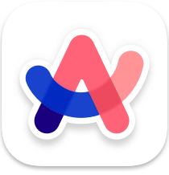
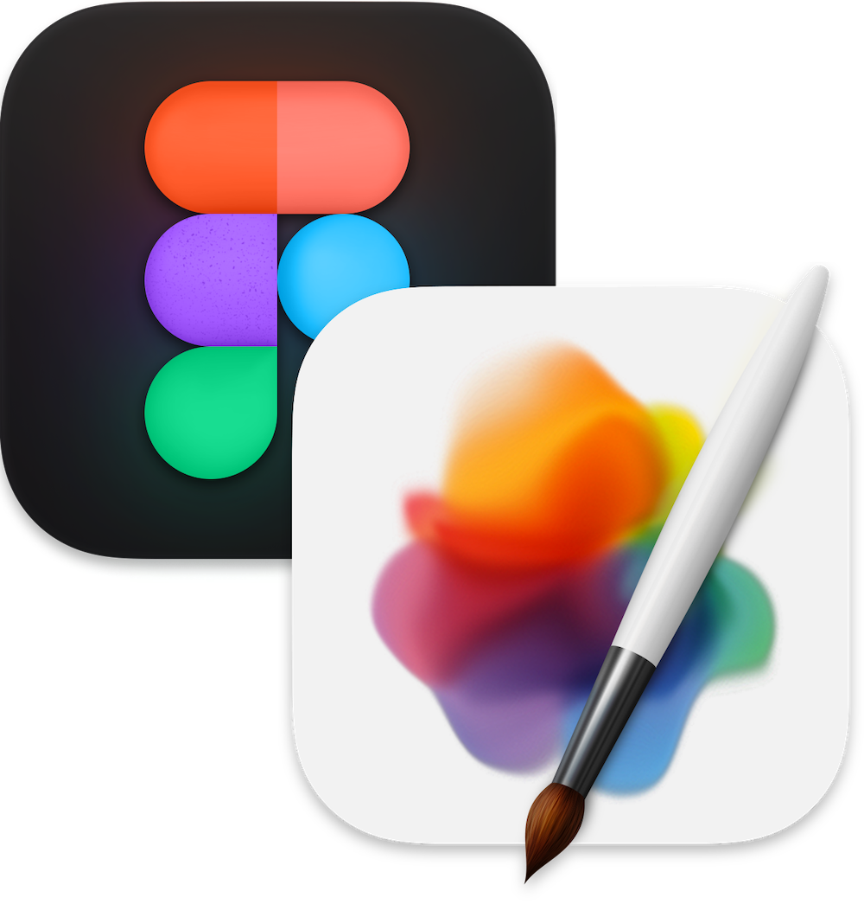
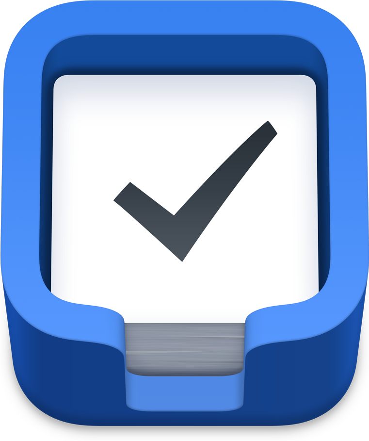
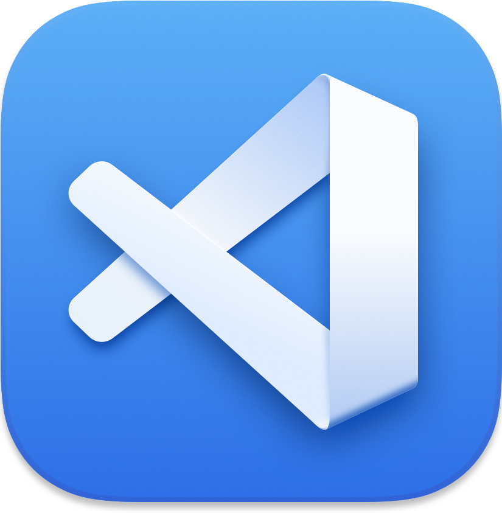

The information outlined here is largely for me as a way to think through my personal processes, communicate them back to myself, and improve them over time. Note that many of the links here will not work for you.

A few shortcuts:

<x-shortcuts>
  <Button url="https://readwise.io/import_freeform">Add highlight to Readwise</Button>
  <Button url="https://roamresearch.com/#/app/chase/page/PWufw2Huu">#Quotes in Roam</Button>
  <Button url="https://www.figma.com/file/u6C1Ws8UvnFIBpA6XgCrWg/%F0%9F%97%83-Swipe-file?node-id=2%3A5">Figma swipe file</Button>
  <Button url="things:///add?show-quick-entry=true">Add task to Things</Button>
  <Button href="https://github.com/chasemccoy/dotfiles">My dotfiles</Button>
  <Button url="roam://#/app/chase/page/ZiuIouwPb">Favorite tags in Roam</Button>
</x-shortcuts>

## Focus modes

Knowing what mode my brain is in can help me focus my attention on the right tasks at the right time. This idea was shamelessly stolen from [The Anatomy of Equanimity](https://anatomy.1651.org).

1. **Connect & play**  
   Scrolling through Twitter, playing guitar, watching a video, creative coding, tinkering with a new idea or design, etc.
2. **Read & study**  
   Getting through my backlog of bookmarks and articles to read, or diving into materials on a particular topic. Logging information into my knowledge base and connecting ideas.
3. **Create**  
   This includes my typical work at the day job as well as working on my website or some other project.

---

## Systems

The processes and infrastructure I've established for dealing with a constant stream of information and media.

### Inboxes

- Simplenote for notes, ideas, blog posts
- Things for tasks
- Readwise for quotes and passages to revisit
- My personal API for saving links to read later

TODO: writing and reading inboxes

<Button url="roam://#/app/chase/page/Kn2giuLHE">Writing inbox</Button>

### Capturing quotes

1. **[Readwise](https://readwise.io/dashboard) to store quotes and passages that I'd like to revisit over time.**

   Readwise has a browser extension and iOS app (with share extension) that make it easy to highlight bits of text and log them away. For books I typically use Readwise's manual entry form.

   <Button url="https://readwise.io/import_freeform">Add highlight to Readwise</Button>

2. **[Roam Research](https://roamresearch.com/) to store relevant quotes about particular topics that I might (or might not) want to reference later.**

   Quotes get inserted using blockquote formatting and tagged with the relevant topics, the `#Quote` tag, and a link to the source.

   <Button url="https://roamresearch.com/#/app/chase/page/PWufw2Huu">#Quotes in Roam</Button>

### Capturing visual inspiration

Interesting images, colors, or photos get dropped into my ["swipe file"](https://en.wikipedia.org/wiki/Swipe_file), which is just a file in my personal Figma account.

<Button url="https://www.figma.com/file/u6C1Ws8UvnFIBpA6XgCrWg/%F0%9F%97%83-Swipe-file?node-id=2%3A5">Figma swipe file</Button>

I've tried using dedicated apps for this, but turns out it's really nice to be able to manipulate and shuffle the images around spatially rather than organizing them with tags, folders, etc.

### Tasks

I use Things to organize tasks, along with a paper notebook to keep track of things I'm focused on in the very short term (usually a week or less).

<Button url="things:///add?show-quick-entry=true">Add task to Things</Button>

#### Regular reviews are key, and I am bad at them

TODO

### Notes and ideas

- **[Simplenote](https://simplenote.com/) is my notes inbox.**
- **[Roam Research](https://roamresearch.com/) is my _writing_ inbox and long term storage of notes with the goal of creating a searchable commonplace book.**

  Roam is for logging things that I don't necessarily need to do anything about, and for connecting ideas together based on topic. Notes in Simplenote are short-lived islands, and when they move into Roam they become networked with all of my other notes.

  A "note" here can refer to an original bit of text or even just a link—the important part is that the note is tagged with relevant concepts or ideas. In Roam, tags _are_ notes and this cross-referencing creates a web of traversable paths through my knowledge base.

  Roam's mobile app is horrible, and the website, though mobile-optimized, is very slow to load. This means I don't usually use Roam for jotting down quick ideas or thoughts. It's more of a destination or an archive than a work bench.

  <Button url="roam://#/app/chase/page/ZiuIouwPb">Favorite tags</Button>

- **The notes section of my website (which you are on right now) is where my _durable_ or _evergreen_ notes live.**

  These notes are the ones that I reference and come back to often, and which have the potential to be long-lastingly useful over the course of my life and career.

- [Taxonomy of note types](https://notes.andymatuschak.org/Taxonomy_of_note_types)

### Bookmarks

I run my own little bookmarking service that stores a running log of links. It’s dead simple and dead fast and I use shortcuts on iOS and Mac to send links to it via [a REST API](https://api.chsmc.workers.dev/bookmarks), which I can then query to pull my bookmarks into various useful places.

### Blog posts

When I have a solid idea for a blog post, I try to create the markdown file in my blog's codebase as soon as possible and write my draft there. I find that this pushes me to complete and publish the draft faster for some reason. I write drafts in both VS Code or iA Writer (depending on my mood, seemingly).

When a draft is still a work in progress I use `hidden: true` in the frontmatter of the post to mark it as a draft. I also have a (hidden) page on this site which lets me see a list of all my current draft posts.

---

## Software

I find that the more complex a system is, the more likely it is to break. While I use many tools and helpers, these are the ones that make up my basic software toolkit—with these and MacOS I can accomplish just about everything I need with ease. I consider each of these to be a dependency, and dependencies are bad, so I am always trying to shorten this list whenever I can.

<x-tools>

### Arc

Arc is my web browser, and one of the most exciting things to happen for the web in decades.

---

### Broadsheet

Broadsheet is my personal portal to the web. It's a custom built, bespoke tool that rounds up content from around the internet and delivers it to me in a calm, slow format. It differs from other web streams in that it's pull, not push. It only updates or refreshes when I say so.

I built Broadsheet because I wanted a starting point for journeys across the web, and a healthier default for when I'm looking for something to fill my attention.

I also have a small text editor built into Broadsheet that allows me to jot down notes or even draft blog posts as I’m browsing and reading. I like it because it's not a feed of immutable-feeling posts—it's a blob of HTML that I can edit, rearrange, and add to however I'd like with 0 friction. This is a great example of making dedicated space for creation in the places where you’re commonly inspired.

---

### Figma and Pixelmator Pro

For all your design and image manipulation needs.

---

### Things

I keep all of my tasks and todos in Things, and I use it roughly according to Cultured Code's ["Getting Productive with Things"](https://culturedcode.com/things/guide) guide. The killer feature for me is ⌃Space for quick entry and ⌃⌥Space for quick entry with autofill\*. The iOS app also offers very quick entry of tasks.

I use 2 areas: **Personal** and **Work**. I typically have 3 types of projects: normal temporary ones, recurring ones (I prefix those with the ↻ symbol), and permanent ones (I prefix those with ∞). I don't really use tags.

\*Cultured Code offers [an installable helper which enables quick-entry autofill](https://culturedcode.com/things/mac/help/things-sandboxing-helper-things3) for websites, emails, and the like.

---

### VS Code

Operator Mono, 16.5px. I use the [One Dark Pro _Darker_](https://marketplace.visualstudio.com/items?itemName=JoelCrosby.one-dark-darker) theme.

I used to have lots of process and tools to sync VS Code settings across machines, but now settings sync is built in if you sign in with GitHub. It's wonderful

---

### GitHub and Tower

git!

---

### Roam Research and Simplenote

notes!

---

</x-tools>

## Productivity kōans

1. **Never start your day at the computer**

   While I like being up and about in the morning, I'm not a morning person in the sense that my best creative or technical work happens early in the day. A sure-fire recipe for disaster for me is waking up and (after my morning routine) immediately sitting down in front of my work computer.

   It’s much better for me to begin the day slowly and start by doing something enjoyable and inspiring like reading a good book or journaling, preferably over a cup of good coffee. Going for a walk or exercising in the morning is another good option.

2. **Practice productive procrastination**

   When my attention begins to wander, there are two options: fill it with a pointless distraction like social media or fill it with another task (preferably something quite different than the current task at hand). Keeping a list of small todos around is useful for those times when you want to procrastinate. Allow yourself to procrastinate, but still do something useful with that time.

3. **Have separate workspaces for your job and your extracurricular creative practices**
4. **If a thing is worth doing, it’s worth doing poorly**
5. **Don’t forget your mise en place**
6. 

### Recommended reading

- [Being productive (arcana.computer)](https://www.arcana.computer/industry/being-productive)
- [The Anatomy of Equanimity](https://anatomy.1651.org/)

---

## Gear

---

## Development environment

<Button href="https://github.com/chasemccoy/dotfiles">My dotfiles</Button>
