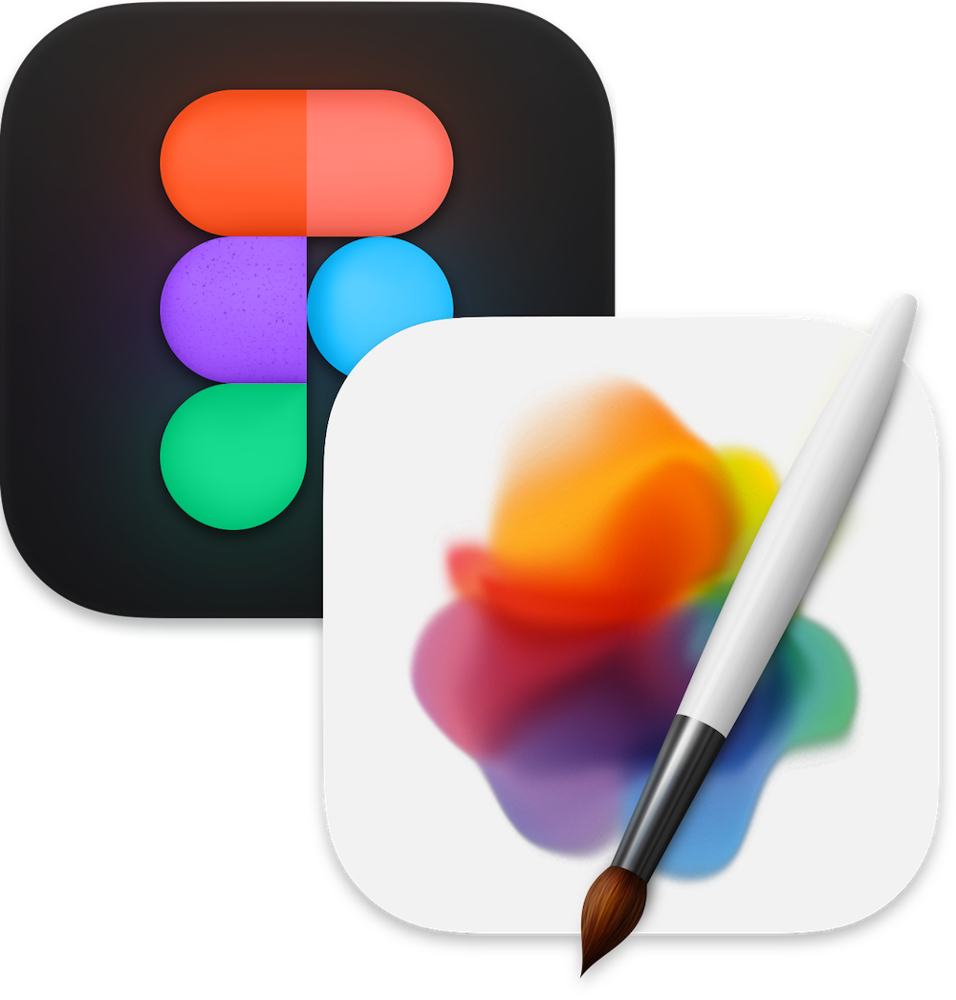
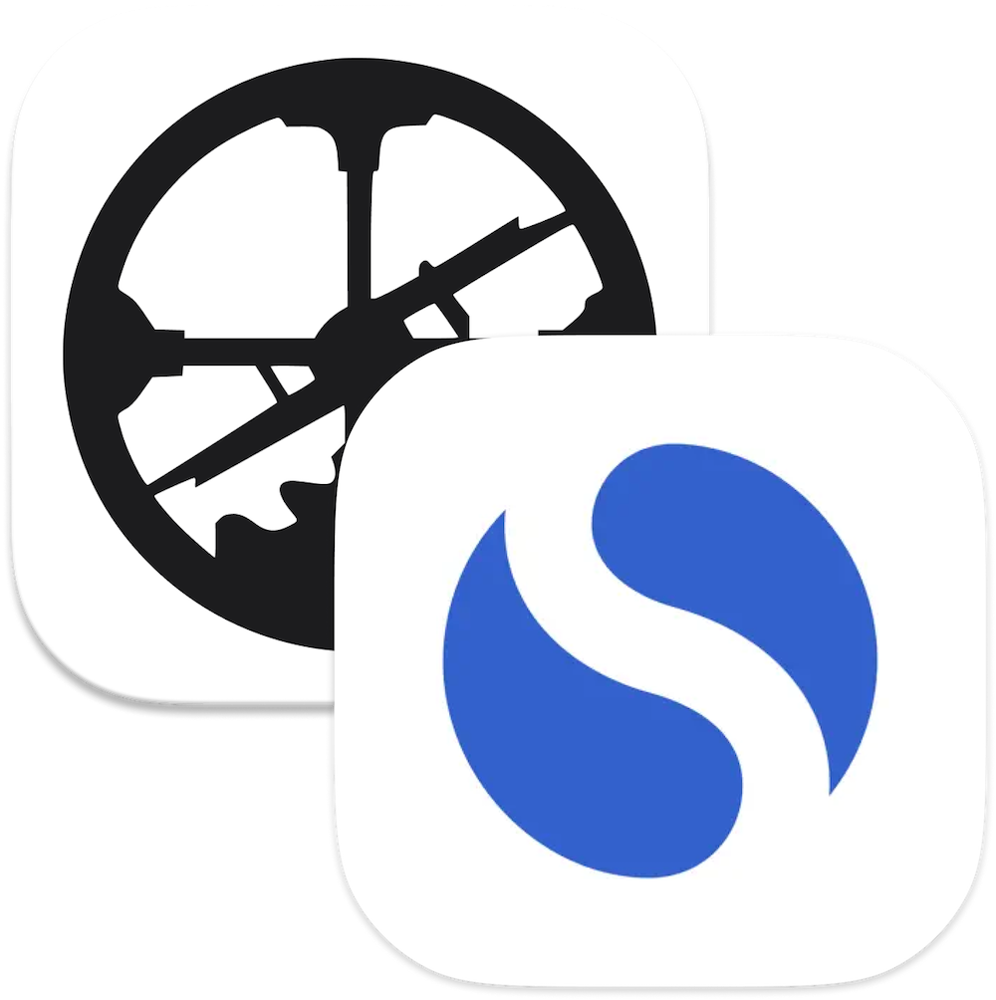

import { Tools } from '.'

The information outlined here is largely for me as a way to think through my personal processes, communicate them back to myself, and improve them over time.

A few shortcuts:

<x-shortcuts>
  <Button url="https://readwise.io/import_freeform">Add highlight to Readwise</Button>
  <Button url="https://roamresearch.com/#/app/chase/page/PWufw2Huu">#Quotes in Roam</Button>
  <Button url="https://www.figma.com/file/u6C1Ws8UvnFIBpA6XgCrWg/%F0%9F%97%83-Swipe-file?node-id=2%3A5">Figma swipe file</Button>
  <Button url="things:///add?show-quick-entry=true">Add task to Things</Button>
  <Button href="https://github.com/chasemccoy/dotfiles">My dotfiles</Button>
</x-shortcuts>

## Systems 

The processes and infrastructure I've established for dealing with a constant stream of information and media. 

### Capturing quotes

1. **[Readwise](https://readwise.io/dashboard) to store quotes and passages that I'd like to revisit over time.**

    Readwise has a browser extension and iOS app (with share extension) that make it easy to highlight bits of text and log them away. For books I typically use Readwise's manual entry form.

    <Button url="https://readwise.io/import_freeform">Add highlight to Readwise</Button>  

2. **[Roam Research](https://roamresearch.com/) to store relevant quotes about particular topics that I might (or might not) want to reference later.**

    Quotes get inserted using blockquote formatting and tagged with the relevant topics, the `#Quote` tag, and a link to the source.

    <Button url="https://roamresearch.com/#/app/chase/page/PWufw2Huu">#Quotes in Roam</Button>

### Capturing visual inspiration 

Interesting images, colors, or photos get dropped into my ["swipe file"](https://en.wikipedia.org/wiki/Swipe_file), which is just a file in my personal Figma account.

<Button url="https://www.figma.com/file/u6C1Ws8UvnFIBpA6XgCrWg/%F0%9F%97%83-Swipe-file?node-id=2%3A5">Figma swipe file</Button>

### Tasks

<Button url="things:///add?show-quick-entry=true">Add task to Things</Button>

### Notes

- [Taxonomy of note types](https://notes.andymatuschak.org/Taxonomy_of_note_types)

### Bookmarks 

I run my own little bookmarking service that stores a running log of links. It’s dead simple and dead fast and I use shortcuts on iOS and Mac to send links to it via a REST API, which I can then query to pull my bookmarks into various useful places. 

### Blog posts

I try to write blog post drafts in the codebase of my blog from the get go, because I feel like it pushes me to complete and publish the draft faster. 

When a draft is still a work in progress I use `hidden: true` in the frontmatter of the post to mark it as a draft. I also have a (hidden) page on this site which lets me see a list of all my current draft posts.

---

## Tools of the trade

<x-tools>

  ### Broadsheet

  Broadsheet is my personal portal to the web. It's a custom built, bespoke tool that rounds up content from around the internet and delivers it to me in a calm, slow format. It differs from other web streams in that it's pull, not push. It only updates or refreshes when I say so.

  
  
  I built Broadsheet because I wanted a starting point for journeys across the web. At its core it’s a collection of links and some associated media. 
  
  I also have a small text editor built into Broadsheet that allows me to jot down notes or even draft blog posts as I’m browsing and reading. I like it because it's not a feed of immutable-feeling posts—it's a blob of HTML that I can edit, rearrange, and add to however I'd like with 0 friction. This is a great example of making dedicated space for creation in the places where you’re commonly inspired.

---

  

  ### Figma and Pixelmator Pro

  For all your design and image manipulation needs.

---

  

### Things

I keep all of my tasks and todos in Things, and I use it roughly according to Cultured Code's ["Getting Productive with Things"](https://culturedcode.com/things/guide) guide. The killer feature for me is `⌃Space` for quick entry and `⌃⌥Space` for quick entry with autofill*. The iOS app also offers very quick entry of tasks.

I use 2 areas: **Personal** and **Work**. I don't really use tags.

*Cultured Code offers [an installable helper which enables quick-entry autofill](https://culturedcode.com/things/mac/help/things-sandboxing-helper-things3) for websites, emails, and the like.

---

  

### VS Code

Operator Mono, 16.5px. I use the [One Dark Pro _Darker_](https://marketplace.visualstudio.com/items?itemName=JoelCrosby.one-dark-darker) theme.

I used to have lots of process and tools to sync VS Code settings across machines, but now settings sync is built in if you sign in with GitHub. It's wonderful

---

  

### GitHub and Tower

git!

---

  

### Roam Research and Simplenote

notes!

---

</x-tools>

## Productivity kōans

  1. **Never start your day at the computer**  

      While I like being up and about in the morning, I'm not a morning person in the sense that my best creative or technical work happens early in the day. A sure-fire recipe for disaster for me is waking up and (after my morning routine) immediately sitting down in front of my work computer.  
      
      It’s much better for me to begin the day slowly and start by doing something enjoyable and inspiring like reading a good book or journaling, preferably over a cup of good coffee. Going for a walk or exercising in the morning is another good option.
  2. **Practice productive procrastination**  

      When my attention begins to wander, there are two options: fill it with a pointless distraction like social media or fill it with another task (preferably something quite different than the current task at hand). Keeping a list of small todos around is useful for those times when you want to procrastinate. Allow yourself to procrastinate, but still do something useful with that time.
  3. **Have separate workspaces for your job and your extracurricular creative practices**
  4. **If a thing is worth doing, it’s worth doing poorly**
  5. **Don’t forget your mise en place**

### Recommended reading

- [Being productive (arcana.computer)](https://www.arcana.computer/industry/being-productive)
- [The Anatomy of Equanimity](https://anatomy.1651.org/)

--- 

## Gear 

---

## Development environment

<Button href="https://github.com/chasemccoy/dotfiles">My dotfiles</Button>