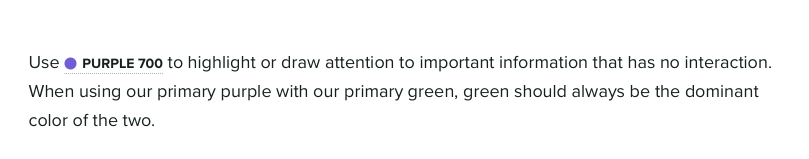
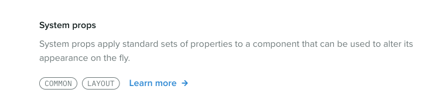

<aside class='callout'>

<b>Note!</b> This article was [originally published on the Styled Component's blog](https://medium.com/styled-components/how-to-build-a-great-component-library-a40d974a412d). Big thanks to [Max Stoiber](https://twitter.com/mxstbr) for letting me share my work with the Styled Components readers.

</aside>

Sprout Social’s design system, [Seeds](https://seeds.sproutsocial.com), has done a lot of growing up since it launched in October of last year. When we launched, our system was home to four categories of guidelines and principles: Brand, Visual, Writing, and Product. A healthy showing, for sure, but something was suspiciously missing  —  components.

Sprout has had a React component library longer than it’s had a design system. We call ours Racine (after the avenue in Chicago where Sprout was once headquartered), and it has long been the source of truth for component patterns in our web app.

At its core, our component library was two things:

1. A package of React components (built with [Styled Components](https://www.styled-components.com) and [Styled System](https://styled-system.com)) published to npm
2. A website, built on [Create React App](https://facebook.github.io/create-react-app/), that acted as a local development environment for our developers and a documentation website for stakeholders across the company.

What began as a slim, hand-crafted tool slowly grew more bloated over time. Racine was passed around by developers who had the time to work on it, but there was no dedicated team to manage it. Eventually, neither the local development experience, nor the experience as a documentation site, were delightful for anyone. We realized the component library was holding us back more than it was helping us.

**We needed to fix this, and _fast._**

When we set out to build our design system, we chose to start from scratch. We didn’t want to adopt any of the debt that our older systems had accumulated, but we did want to use what we had learned from our previous attempts at component libraries to build something strong and stable for the future.

We knew how silly it would be to have component documentation separate from the design system, and thus integrating it would be our highest priority after launching our system. We also knew that it presented us with a fantastic opportunity to not only port the documentation into Seeds, but to make every inch of the experience better along the way (for both developers and consumers).

The design systems team at Sprout Social is relatively small. Our team of 3 (including myself) serves design and engineering teams of well over 30 people each. I want to share some of the tools that our team used to build a component library that all of those folks love using.

## Separate development and documentation

Today, Racine lives on as our component library. But no longer does it try to do the job of development tool and documentation site. [The documentation now lives in our design system](https://seeds.sproutsocial.com/components/), and our component library is just a tool for building, testing, and using components in web projects at Sprout.


We learned over time that **when the experience of building a component is intertwined with the experience of documenting it, the latter tends to suffer**. We had many developers who would build and ship new components in our library for themselves without documenting them for others.

Documentation will always fall short when it’s treated as a subtask of the development process, which is how our component library operated in the past. We wanted to change that by redesigning our documentation to make sure that both designers and engineers were invested in its success.

So, we decided to split it into two separate experiences:

1. The documentation for our components moved into our design system, alongside all of our other patterns and guidelines.
2. We added a separate local development environment based on [Storybook](https://storybook.js.org).

Storybook gives our developers an extremely fast and lightweight environment to build and test components. Documentation happens in our design system, which is a custom-built site powered by [Gatsby](https://www.gatsbyjs.org).

Previously, when a new component was created it would appear in our documentation site by default, whether or not it had been properly documented. Now, even if a developer adds a new component, that component isn’t “available” until we’ve written thorough documentation for our system. This puts the task of documentation on equal footing with the task of development.

On that note, **we also learned how crucial it is to apply friction in the right places**. We applied friction to making components available to our entire organization, and that means we now have more time to be strategic about how our work is rolled out. We can design micro education and marketing campaigns that not only increase awareness more broadly, but also make our teammates feel more supported and invested in the continuing success of our system. That investment pays us back tenfold in the form of feedback and contribution.

We’ve explored the idea of these micro campaigns in a few ways that have helped spread awareness for our component library internally:

- We’ve held **a series of optional workshops** with our teammates (not just engineers!) where we leveraged our design system and component library to prototype UI that matches our product patterns.
- For a few high-value projects, we created **internal landing pages with Seeds** that serve as hubs for information about the projects and their teams.
- We are currently exploring the idea of **a series of “sponsored” Slack posts that highlight our component recipes**. These recipes are short snippets of code that demonstrate how to use our components to solve a common UI problem or create a pattern often seen in our app. We want to drip these out to our developers in the form of small, well-designed Slack messages that get shared in common channels as a way not only educate, but also to drive excitement.

## Empower authors

Being able to focus on documentation in isolation from development has proven to be crucial for us, and it has allowed us to discover that the key to facilitating really great documentation for a design system is to focus on two key areas of the experience:

1. **Authorability.** People are busy, and they have better things to do than spend their time writing documentation. Plus, writing good documentation isn’t easy. We wanted to remove as many points of friction as possible to make sure that the authoring process wasn’t keeping anyone from contributing.
2. **Interactivity.** People don’t like writing documentation and they don’t like reading it either, especially when they are trying to get their jobs done. We didn’t want our documentation to feel like a manual that needs to be read from cover-to-cover, but instead like a tool that can be _used_.

[MDX](https://mdxjs.com), if you’re not familiar, is described as “Markdown for the component era.” Simply put, it’s a tool that allows users to write React components inline with their Markdown, which solves these two problems for us very well.

Markdown is well known and easy to pick up, and many of the tools that our team already uses (like Dropbox Paper or Confluence) can export content to Markdown. That means our teams can write wherever they want and we can drop their content directly into our system, which lowers the barrier for authors to get started.

And, of course, the inclusion of React components means we make content more interactive by dropping in any UI we want into our documents.

MDX even allows us to customize how native Markdown elements are rendered. For instance, authors can write a regular Markdown code block, like this:

````md
```jsx live
<Box
  display='flex'
  alignItems='center'
  justifyContent='center'
  bg='neutral.100'
  color='neutral.1000'
  p={600}
>
  This content will be centered within the box.
</Box>
```
````

and we can output an interactive, editable code block in our design system that looks like this:


Imagine how difficult it would have been before MDX to achieve something like this without the author of the documentation having to hand-write HTML or React.

MDX not only allows you to import any React components, but also allows you to specify a set of components that are available in the global scope. This means we can have “shortcode” like components for rendering common elements.

For instance, to embed a video from YouTube, authors can just use the shortcode without having to import anything:

```jsx
<Youtube id='abc123' />
```

For our component documentation, I made a shortcode that renders the table of component properties for any component in our library:

```jsx
<PropTable component='Button' />
```

Good tools don’t make a design system, and they won’t increase engagement with your system if you aren’t focused on solving people problems. But great tools can lower the barrier of entry to contribution, and they can make the chore of maintaining a system much less tedious (which gives us more time to focus on people).

## Delight the consumers

Great documentation should be less like a document and more like a workshop. Not only does interactivity make the experience more enjoyable, but it also lets us communicate more information to our consumers.

We’ve tried not to make any of the content in our design system “templated”. When contributors author new content, we don’t give them a structure to fill with information. Instead, we try to let the information inform the structure itself. Here are a few cool examples of this from our system.

### Interactive code blocks

Every Markdown code block in our component pages turns into a fully editable sandbox for the component. Being able to try out different combinations of props is _huge_ for both our developers and designers. Each code block is like a mini prototyping tool that makes writing code seem as simple as changing a few values.

Those editable code blocks are all thanks to [an excellent library called react-live](https://react-live.kitten.sh). One of the best features of react-live is that it allows us to specify a global scope for every code block on our site. We threw all of our components into the global scope, so that no matter what page you're on you have access to all of our components. If you're on [the page for the Icon component](https://seeds.sproutsocial.com/components/icon), and you want to see how it looks inside of a [Button](https://seeds.sproutsocial.com/components/button), you can just try it out right there on the page.

That doesn’t just benefit our consumers. I can’t count the number of times I have used this for education and advocacy purposes. When a teammate reaches out with a question about how to something should work I can jump into a code block on Seeds, prototype a quick solution, and send over a screenshot with the code. In the future, we may even build upon that by having a “share” button on each code block that exports an shareable image (similar to something like [Carbon](https://carbon.now.sh/)).

### Token tags

At the core of our design system are our design tokens — the atomic values that represent our color palette, typography scale, motion guidelines, etc.

We offer our design tokens in a variety of formats (Sass variables, JavaScript constants, etc.), and we reference them all over our design system. Instead of just referring to our tokens by name when we are writing content for our system, we created what we call **Token Tags** (patent pending):


That’s an example of a color token tag, which gives the reader an immediate visual reference to the actual color (instead of just a cryptic Purple 700). When the reader hovers over the tag, they can see the hex value for the color, and clicking the tag will copy the hex value to their clipboard:



This idea is a great example of ways we are using MDX to make our documentation more interactive, and in turn bringing more value to our consumers instead of making them dig for it themselves.

### Typography playground

Another great example where breaking out of the usual format allowed us to deliver a better experience is on [our Typography page](https://seeds.sproutsocial.com/visual/typography).

We have a complex typographic scale that differs between our product and our brand and marketing materials. Instead of listing this out in a table, we built an interactive tool that takes inspiration from the websites of our favorite font foundries:


Users can paste in the copy they would like to typeset, and then select whether it’s being used in our product or in a visual project (brand and marketing materials). Then, they’re presented with all of the valid values and combinations of values. And, of course, they can copy the design token for whatever environment you’re working in.

### System props

All of our components are built with [Styled Components](https://www.styled-components.com/), and we use the excellent [Styled System](https://styled-system.com) to attach “system props” to our component. Here’s how we describe these props in our documentation:

> System props apply standard sets of properties to a component that can be used to alter its appearance on the fly.

We hook these system props up to our design tokens, so that consumers of our components can customize styles using our design tokens. Here’s an example of setting a color: `<Text color="green.500" />`.

We are very careful about which system props we apply to which components. We don’t want consumers to be able to change _every_ style on _any_ component, so we break the system props out into groups (a technique which we shamelessly stole from the [GitHub Primer](https://primer.style) team, [who do the same for their components](https://primer.style/components/docs/system-props)):

- `COMMON`
- `TYPOGRAPHY`
- `BORDER`
- `LAYOUT`
- `POSITION`
- `FLEX_CONTAINER`
- `FLEX_ITEM`

Every component in our system gets the COMMON group, which allows consumers to change the margin, padding, color, or background color of the component.

On every component page in our design system, we let the user know exactly which groups of system props that component has access to. When you hover over those groups, you can see which props are included therein:



When developers first hover over these groups, their faces light up when they realize how much power is baked into our components. The system props let them compose UI in half the time, without having to write any CSS. Most importantly, system props make it laughably easy for developers to use our design tokens. When the most consistent thing is also the easiest thing, developers don’t have to break out of the system to get their work done, and you end up with a much more consistent experience.

## What’s next

Getting our component library integrated with our design system is really just the beginning for us. If we were thinking in terms of version numbers, we would say that our system is now at version 1.0.0, which means there is plenty of room to grow. Here are some things we are focusing on next:

- **Education** in the form of workshops with the web developers and product designers on our team. New things come with a learning curve, and we want to make sure we are supporting our users by helping them understand the tool we have created.
- **Reliability** in the form of visual snapshot testing for our components. We want to be able to release updates to our component library with confidence that we aren’t breaking anything for anyone. We already unit test our components, but we will be working to integrate visual tests so we can ensure our components stay pixel perfect when we make changes.
- **Expanding** our offering by adding more components and continuing to document existing ones. We are just getting started with what our library offers, and we want to increase contribution to our system from engineers who are not directly involved with the projects. In addition, we are updating documentation as we go in response to commonly asked questions and use cases presented by our users.

All of this work will happen in parallel with the primary task of our design systems team — taking care of people. This piece has touched on a lot of the flashy artifacts of our system, but a majority of the work happens in Slack channels, Google Doc comments, and conversations with our team. **Our system doesn’t mean anything without a diverse culture of collaboration and contribution that ensures we’re accurately representing our product and teams.**

Finally, it’s important to note that we didn’t do any of this work in a vacuum. I want to highlight a few people and projects that have helped us get to where we are now:

- [The GitHub Primer team](https://primer.style) has heavily influenced the technical direction of our system. Specifically [Emily Plummer](https://github.com/emplums)’s work on [their React component library](https://primer.style/components) (we basically modeled our system after Primer). Thank you to the Primer team for doing all of your work in the open — people are watching and we are so grateful.
- [The folks behind MDX](https://mdxjs.com/about#authors) and it’s accompanying plugin for Gatsby, [gatsby-mdx](https://gatsby-mdx.netlify.com). Extra thanks to [Chris Biscardi](https://www.christopherbiscardi.com) (the creator of gatsby-mdx) for fielding my many questions as we worked to adopt MDX in our Gatsby site in the early days of the plugin.
- [Max Stoiber](https://mxstbr.com) for [Styled Components](https://www.styled-components.com), and [Brent Jackson](https://jxnblk.com) for [Styled System](https://styled-system.com). They making building component libraries a joy.
- [Netlify](https://www.netlify.com) for hosting our system, and [Algolia](https://www.algolia.com) for generously powering our search via [their DocSearch product](https://community.algolia.com/docsearch/).

If you want to learn more about the design systems team at Sprout Social or what we’re up to, feel free to reach out to me on Twitter **[@chase_mccoy](https://twitter.com/chase_mccoy)** or email our team at **[designsystems@sproutsocial.com](mailto:designsystems@sproutsocial.com)**. And of course, you can check out our design system, Seeds, at **[seeds.sproutsocial.com](http://seeds.sproutsocial.com)**.
