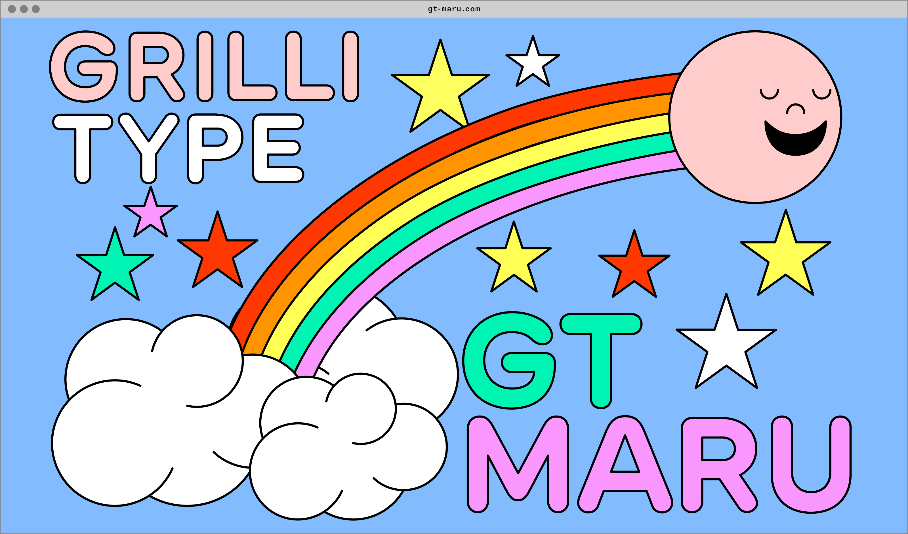

This collection was produced during the [Small Season known as Rikka, the start of summer](https://smallseasons.guide):

> The songs of summer begin. Frogs start their singing, and birds chirp in the forests. Worms surface from underground, bamboo shoots begin to sprout.

Summer is slow to arrive here in Chicago, but I've received both doses of the vaccine and that feels pretty great. Here are some things I've appreciated lately.

<hr class='break' />

A new project from Brie Wolfson called [The Koolaid Factory](https://koolaidfactory.com) is a series of zines about the ways organizations coordinate, collected in the form of a beautiful website.

While exploring the site I discovered that the illustrations for the project were done by [Leila Register](https://leilaregister.com), who I then learned also does art for Chicago's [Hopewell Brewing](https://www.hopewellbrewing.com), which is a neighborhood favorite of mine.

Small world.

<hr class='break' />



[GT Maru](https://gt-maru.com) is a new typeface from Grilli Type that's inspired by the wayfinding signage of Japan. Let's ignore for a moment that this is a fantastic typeface, which it is, to acknowledge the wonder of the "minisites" that Grilli creates for their typefaces.

Just the concept of a minisite is great. By what measure is this site smaller than others? By the amount of pages within the site? By the narrow purpose that the site serves? What would the web look like if websites were organized by size and shape?

<hr class='break' />

I'm generally a sucker for a good space story, and during the past year I've noticed that alternate history fiction has been especially comforting. The Apple TV show _For All Mankind_ is the intersection of these two, and its recent season 2 finale was particularly great television.

The finale managed to weave many divergent plot lines together in a really satisfying way, which I feel many shows struggle with. [Vox calls it the best TV episode of 2021 so far](https://www.vox.com/culture/2021/4/23/22396461/for-all-mankind-season-2-finale-recap-the-grey-review-ron-moore), and I feel as though I must agree.

<hr class='break' />

Svelte is a web framework which I don't often use but like to keep my eye on. They recently shipped a new feature outlined in [RFC 13, titled "Passing CSS custom properties to components"](https://github.com/sveltejs/svelte/pull/6237). The feature allows you to set CSS custom properties on Svelte components with a dedicated syntax:

```js
<Component --myCustomProperty="tomato" />
```

I love this. The syntax so clearly harkens back to CSS by using the double hyphen signifier that it almost feels like a part of HTML itself (something I appreciate in other Svelte idioms as well). This would be immensely useful in regular HTML, and would avoid us from needing to write inline styles in order to set custom property values.

<hr class='break' />

Like many other kids in my generation, I loved Pokémon when I was growing up. That shouldn't really be a surprise—the entire concept is built around gamifying ecology (albeit, a fictional one). It makes you wonder if we missed an opportunity to take the same approach with our own ecosystem.

[ASH is a project from a studio called FINH](https://www.finh.cc/ash) that wants to do just that by creating a Pokédex-like device that can provide (using AI) information about the world around us, simply by pointing a camera. The video for ASH points out that "we can't protect what we don't know."

ASH seems to only be a concept at this point, but I'm keeping a close eye on it as I'm generally fascinated by technologies that help us build a stronger connection with a physical environment rather than a digital one.

<hr class='break' />

Speaking of projects using technology in wholesome ways, I'd like to briefly mention [hyperlink.academy](https://hyperlink.academy), which is a platform for creating and participating in online courses created by folks from the community. The types of courses offered on Hyperlink are incredible, very _online_, and range a huge spectrum of topics. Here's a few running at the moment that stand out:

- [Journaling for the long haul](https://hyperlink.academy/courses/journaling-for-the-long-haul/84/cohorts/137)
- [Websites for creatives](https://hyperlink.academy/courses/websites-for-creatives/66/cohorts/138)
- [Art of memory](https://hyperlink.academy/courses/art-of-memory/122/cohorts/140)
- [Personal cinema by way of beginner's mind](https://hyperlink.academy/courses/personal-cinema-by-way-of-beginners-mind/100/cohorts/141)

If this sparks your curiosity, [consider signing up for their newsletter, Hypotenuse](https://hyperlink.academy/hypotenuse).

<hr class='break' />

Speaking of newsletters, one of my favorites of late is [an advice column from Heather Havrilesky called _Ask Polly_](https://askpolly.substack.com). Heather's writing is captivating and at times heart-wrenching. I really admire how she goes right for the jugular every time.

<hr class='break' />

It's incredibly easy to create a simple website with a few basic tools, even though the current state of front-end development might have you believe otherwise. That being said, creating something that is uniquely expressive and free form is not so easy without more CSS experience. Enter [mmm.page](https://build.mmm.page).

[The creator, XH](https://twitter.com/xhfloz), has made a wonderful tool that is completely free-form, while still ensuring that sites work even on mobile devices. You can have the awesome webpage in your head live on the internet in minutes. Highly encourage you to give it a shot.

P.S. the homepage for mmm.page is at build.mmm.page, which is just great. Every time I see it, I read it out loud like it's a statement—"build 'em page."

<hr class='break' />

Ethan Marcotte (unsurprisingly) has [some wise words about the phenomenon of design systems fatigue](https://ethanmarcotte.com/wrote/designish-systems) and that fact that you can't patch your way towards a better method of working.

<hr class='break' />

If you've ever wondered how we do design at Stripe, you're in luck. Two of my wonderful colleagues, Connie Yang and Tayler Aitken, [gave a talk about just that recently at Figma's Config conference](https://www.youtube.com/watch?v=08TsVjUKH4M). Also worth checking out is John Palmer's talk, titled _[Exploring spatial software](https://www.youtube.com/watch?v=H4LosXgKX4g&list=PLXDU_eVOJTx68R0B8tettMfY6XeItWhV4)_.

<hr class='break' />

That's it for now. Go outside and breathe in the warm air. 🌻✌️
