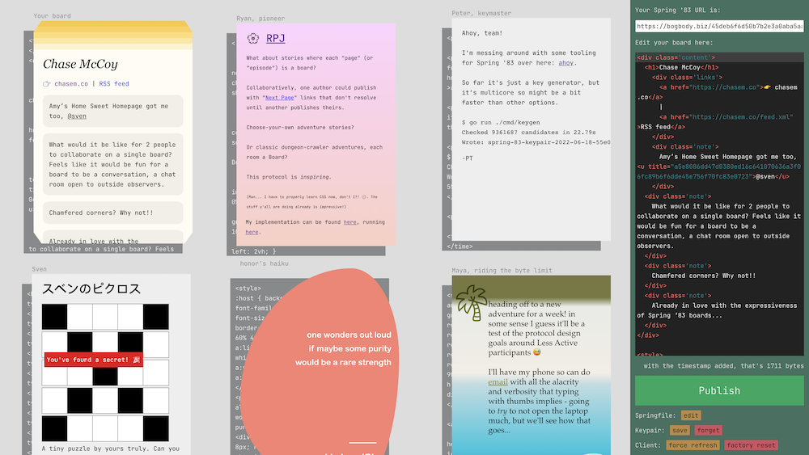

If you read any of my writing you know that Robin Sloan is one of my favorite internet thinkers. He's just published [a spec for a new web protocol](https://github.com/robinsloan/spring-83-spec/blob/main/draft-20220616.md) he's designed called Spring ‘83.

I'd encourage you to read the spec yourself and check out the demo client. Just look at it:

It's just so wonderfully web-ish.

Robin frames this work around imagining alternative "ways of relating" across the internet. So many of our current ways of relating online (social media, RSS, email) do a create job of syndicating and delivering content, but they sacrifice the presentation of the content and in doing so lose a key piece of what makes the web so great: creativity, expression, and freedom.

Robin touches on this in [his newsletter announcing Spring ‘83](https://www.robinsloan.com/lab/specifying-spring-83):

> For my part, I believe presentation is fused to content; I believe presentation is a form of content; so RSS cannot be the end of the story.
>
> <cite>[Specifying Spring '83](https://www.robinsloan.com/lab/specifying-spring-83)</cite>

I hadn't thought about this much before, but subconciously I've always been aware of it on some level because when I read RSS I much prefer to jump out to a person's website rather than reading in the client. It feels more personal and imparts the voice of the author. Reading on the source website feels like stepping into someone's home for a chat, whereas reading in an RSS client feels more... clinical.

It makes me dream of an RSS reader that could emulate the styles of the websites it's syndicating. I'm reminded of [a protocol-like idea from Kicks Condor called "whostyles"](https://www.kickscondor.com/whostyles) which is "a way of styling syndicated hypertext from other writers."

Whostyles calls on website owners to make a chunk of CSS available at a well-known URL that others can embed into their sites to match the style of the original. If everyone implemented a whostyle for their site, an RSS client could use it to personalize the display of feed entries.

Spring ‘83 feels like it's getting at these ideas, and it's doing so by embracing HTML/CSS as a creative tool and a medium unto themselves.
