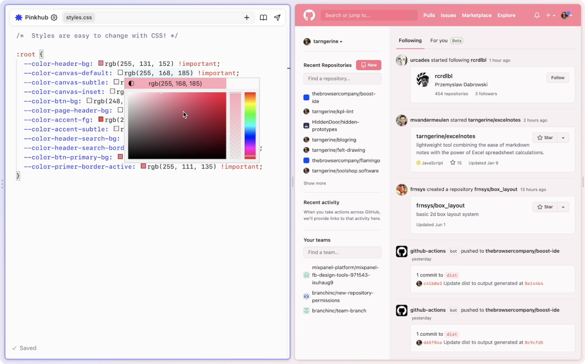

[The Browser Company of New York](https://thebrowser.company/) is building a web browser called Arc, and they recently shared a preview of [a new feature called "Boosts"](https://www.loom.com/share/55e80c00d4444579b5d0de49d9ffc650).

Boosts are a reinvention of browser extensions—a built-in way to _boost_ the web by writing your own code (HTML, JavaScript, and CSS) that can run on any website or specific ones that you assign. Check out this example of applying custom styles to GitHub:

Look at that! The webpage on the right is the canvas, and the code on the left is the medium. They've even built in visual editing tools such as a color picker.

Webpages have always been destinations, but this invites them to be starting points—blank canvases, even. Your browser now invites you to extend and reimagine the web in whatever way you see fit.

It has always been possible to run user scripts and styles via browser extensions, but the developer experience of creating an extension has never been particularly beginner friendly. I've personally never seen extension development integrated so seamlessly and directly into the browser. Arc even implies that working with the web might be just as important as browsing it—in Arc's interface, the Boost editor sits at the same level as the page you're browsing, not in some nested panel that feels secondary to the experience.

Under the hood, Boosts are just a folder of HTML, JS, and CSS files. You can zip them up and send them to a friend, if you'd like. One can imagine a way to easily share boosts on the web in some sort of marketplace built right into Arc. There could be entire forums dedicated to sharing boosts around like Winamp skins for websites.

Boosts empowers even non technical users to _create_ with the web rather than simply consuming it. The possibilities are exciting, and it’s refreshing that they’re being explored by a startup in 2022 at all.

I’m interested in software that works _for_ us, our creativity, and our attention. The web is a powerful building material with a variety of textures, and it’s time we had tools that let all of us take advantage of such an incredible resource.

From The Browser Company's email to Arc beta members about Boosts:

> So, what happens to the internet when changing the internet is this easy?

I can't wait to find out.
