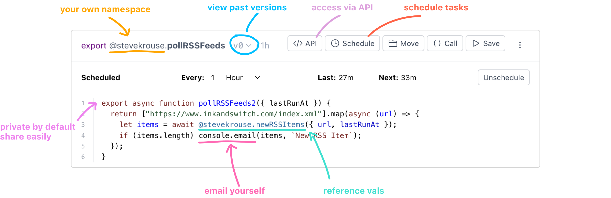

When I was learning how to code, one of the most confusing aspects was "where do I put this code to make it go?"

It's easy enough to create an `index.html` file, open it up in TextEdit, and start writing. But how do I view the output of my work? Perhaps more importantly, how do I let others view the output of my work across the web?

It's easy to get overwhelmed when you start learning about servers and hosting and all of the necessary infrastructure to take some code and put it on the web. It gets a lot harder the minute you want to do anything dymanic—I need to configure a database? How do I access that from my lowly `.js` file?

What if all of that was as easy as using the web inspector? [val town](https://www.val.town) is is exploring some of these ideas. This annotated screenshot from their homepage gives you a good sense of what val town is for:

- Your own namespace on the web is an idea with a lot of potential. In val town you can keep your functions and any data you'd like within that namespace. You could open up parts of that namespace for others to use. Imagine all of the apps you use hooking into this namespace, both reading data from it and writing data to it. If all of your personal data was as easy to access as referencing a variable, what would you do with it?

---

https://twitter.com/stevekrouse/status/1629232279624077312
