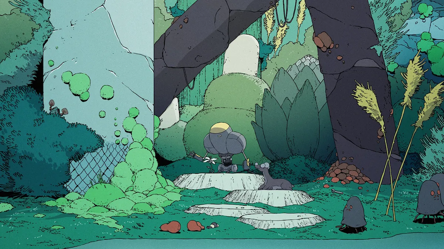

Autumn is my favorite time of the year. The trees outside my apartment here in Oak Park are shining gold, and the air is starting to feel crisp and cold. Sweater weather, if you will.

')

Besides the weather and foliage, the best part of the season may just be its rituals. One of my favorites is an annual rewatching of Over the Garden Wall, which is the coziest, most endearing television series I've ever seen.

If the show is to teach us anything, it's that things are not always what they seem.

---

I'd be remiss if I didn't link to [this wonderful exploration of vintage postcards](https://weirdchristmas.com/2017/10/03/over-the-garden-wall-and-vintage-postcards) that share a vibe with OtGW from the blog Weird Christmas (which is written by, get this, Craig Kringle). The entire site is dedicated to vintage Victorian Christmas cards, which Craig collects and shares online.

')

A few of the show's scenes appear to take almost direct inspiration from some of the postcards in Craig's collection. There is truly nothing new under the sun.

---

I recently discovered that a new animated series on HBO Max, Scavenger's Reign, is based upon [an animated short](https://www.youtube.com/watch?v=1TRzemJbUsw) which appeared online 4 years ago by Joe Bennett and Charles Huettner.

The short caught my attention when it originally released for being a beautiful and wholly original bit of science fiction. Sometimes the internet, like the world, is full of serendipity, and you might rediscover something familiar just like you might stumble into an old friend at a crowded place.

The first six episodes have already premiered, and I'm hooked already. The style is something like a cross between Fantastic Planet, Sable, and Nausicaä of the Valley of the Wind.

I am such a sucker for any media that takes world building seriously, and the world of Scavenger's Reign is overflowing with details—flora, fauna, and environments as alien as you've ever seen. The ecology of Vesta Minor, the planet on which the show takes place, is just as much a character as the humans stranded there.

---

Since there seems to be an animation theme going here, I'll briefly mention how excited I am for the upcoming animated Scott Pilgrim series on Netflix: Scott Pilgrim Takes Off. I have a love for both the graphic novels and the 2010 film, whose cast will be returning to voice the characters in the new series.

Robin Sloan recommended the book [Ghosts and Demons of India](https://bookshop.org/p/books/ghosts-monsters-and-demons-of-india-rakesh-khanna/19691587) in his latest newsletter, and I picked up a copy of my own just in time for Halloween.

I love books that can be imbibed in small sips like a hot cup of coffee. Ghosts reads like an encyclopedia of creatures and spirits from the Indian subcontinent, and each entry conjures up the most vivid images. I have no idea the pantheon of ghost stories in India was so vast!

Allow me to recommend one of my favorite blogs of late, which excites me every time it appears in my RSS reader. It is the wonderful [Going Medieval](https://going-medieval.com) by Dr. Eleanor Janega, who specializes in "late medieval sexuality, apocalyptic thought, propaganda, and the urban experience in general." How cool is that??

Dr. Janega uses their expertise to make comparisons and critiques between modern internet culture and that of medieval societies. One of their latest posts was sparked by [the recent national test of the Integrated Public Alert and Warning System (IPAWS)](https://www.fema.gov/emergency-managers/practitioners/integrated-public-alert-warning-system/national-test-2023) on October 4 in the United States, which caused everyone's smartphones to scream in unison. If you're like me, you found it surprising and terrifying despite the numerous warnings online in the weeks leading up to the test.

Some folks found it more than surprising, though, and used it as the basis for conspiracy theories related to 5G, vaccines, viruses, and the like.

We often like to think of medieval European societies as unenlightened, unintelligent, and superstitious, but Dr. Janega reminds us that we're not much better ourselves. Many bogus explanations were offered for the Black Death, and the parallels with how people respond to public health emergencies today are eery.

Definitely go read the whole piece, it's full of gems like this:

> I have repeatedly heard people now refer to the fact that “medieval streets were full of shit” to explain the spread of the Black Death. This is interesting because it is 1) not true – most medieval cities tightly regulated the disposal of human waste very strenuously and 2) would be irrelevant anyway even if it were true (it’s not) because that’s not [how *yersinia pestis* travels](https://emergency.cdc.gov/agent/plague/faq.asp).
>
> <cite>[On sickness and conspiracy](https://going-medieval.com/2023/10/05/on-sickness-and-conspiracy)</cite>

While I was writing this up, Dr. Janega posted another banger just in time for Halloween: [You are not, in fact, the granddaughter of the witches they couldn’t burn](https://going-medieval.com/2023/10/20/you-are-not-in-fact-the-granddaughter-of-the-witches-they-couldnt-burn).

Robin Rendle recently shared [how he views the browser as a printing press](https://buttondown.email/robinrendle/archive/the-browser-is-a-printing-press):

> So I’ve never seen myself as a designer or engineer or writer, but as a third thing. It’s sort of pompous and silly to call myself this word though, so I avoid it, but deep down it’s what I’m always thinking whenever someone asks what I do. But here, in this secret society of the newsletter, I will admit to you:
>
> 1. I’ve always seen the browser as a printing press.
> 2. Because of that, I’ve always seen myself as a publisher first and then everything else second.
>
> <cite>[Robin Rendle, The Browser is a Printing Press](https://buttondown.email/robinrendle/archive/the-browser-is-a-printing-press/)</cite>

I couldn't agree more. The power of the browser is not that it gave us the ability to write or create art or build programs, but that it allowed anyone to publish those things to the entire world.

The application of the web—design, engineering, writing—are all interests of mine, but for me they're inevitably second to the printing press itself.

---

Speaking of Robin, be sure to check out his latest newsletter, [The Cascade](https://robinrendle.com/the-cascade) which focuses on the past, present, and future of CSS. Robin has been exploring new color features in CSS in the latest issues and it's been a delight to follow along with.

---

In the spirit of publishing, I've been working on a little side project that is an ode to the written word.

While I appreciate the convenience of ebooks and audio books, I have always preferred to own and read physical copies. As a result, I've accumulated quite a few books that are becoming increasingly difficult to store and move around. I know at some point I'll need to slim down my collection, but I wanted to preserve it in its current form.

To that end, I decided the place to start would be creating a database of all the books in my physical collection. I spent a few weeks inputting titles, authors, dates, ISBN numbers, page counts, and more metadata about the titles on my shelves. I still have a few boxes of books to go through and log, but most of my collection is now captured digitally.

I decided to use Airtable for this job, partly because it has such an easy to use API. I wanted to display my collection in a way that was more pleasant to browse than a spreadsheet, so I built my own little frontend for the database.

It's still very much a WIP, and not as performant as I'd like it to be just yet, but you can take a peek at [books.chasem.co](https://books.chasem.co)

Now I feel much more comfortable donating some of my books knowing that I'll always be able to look back over my collection.

I hope this season find you well. With reverence to the Great Pumpkin,

Chase
