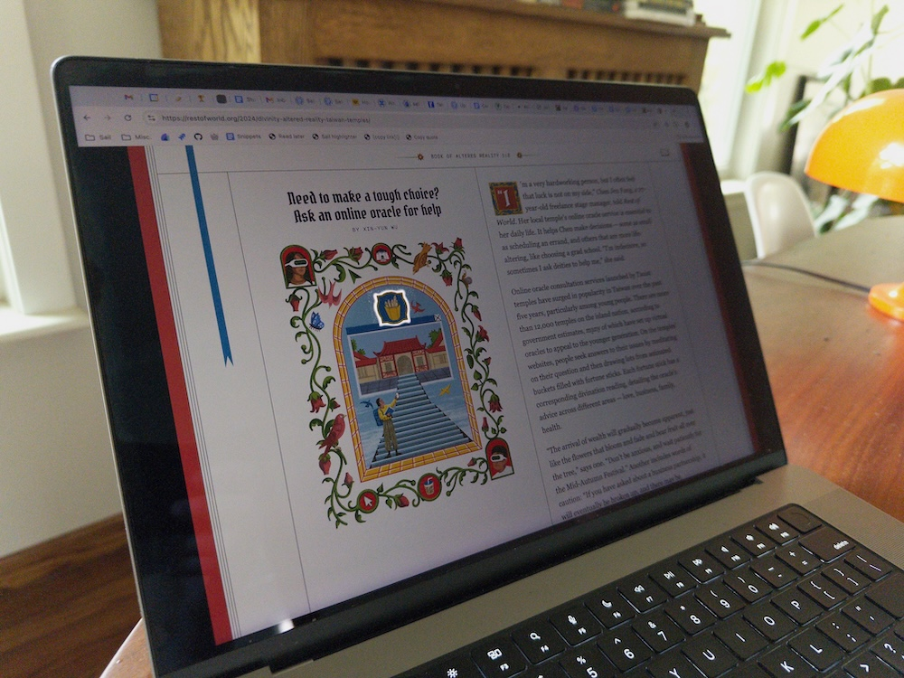

A good day on the web is one where you stumble across a website that makes you go "woah??" and then "huh...?" followed by a wide grin. I have one of those websites to show you!

[Digital Divinity](https://restofworld.org/series/digital-divinity) is a really neat project documenting the ways in which new technologies are being incorporated into religious practices. Each entry is accompanied by a lovely illustration from an artist named [Glenn Harvey](https://glenn-harvey.com).

Those illustrations are hiding a secret though, one that is only revealed on specific devices under specific conditions. 

You might be aware of a visual effect related to HDR videos if you've ever scrolled Instagram on your iPhone—the pixels displaying the HDR content display in full brightness, while the rest of the screen is slightly dimmed. 

The effect can be disorienting and strange, especially for content that is pure white, which appears as some kind of _ultrawhite_. It makes other white areas of the screen look pale and pallid. 

The illustrations for Digital Divinity make use of this effect in a brilliant (literally) way by masking a pure white, HDR video such that parts of the illustration glow with an ethereal brightness. For devices that support displaying HDR content brighter than the rest of the screen, the effect is stunning.

If you're curious how this effect was achieved, [I built a recreation to demonstrate the technique](https://lab.chasem.co/hdr-white-shinethrough).

This is the kind of creative touch that makes designing for screens so special: our work gets better when we give ourselves over to the unpredictability of the medium. Many users will never see this effect because their device doesn't support it, but rather than flattening the experience for consistency the designers behind this project decided to embrace the chaos.

Every device and screen is different, and one of the biggest mistakes we can make in web design is pretending as if we're creating a singular experience to be experienced uniformly by each user. There are opportunities for delight in the gaps created by our medium's flexibility.

Kudos to all of the designers who had a hand in this wonderful project.