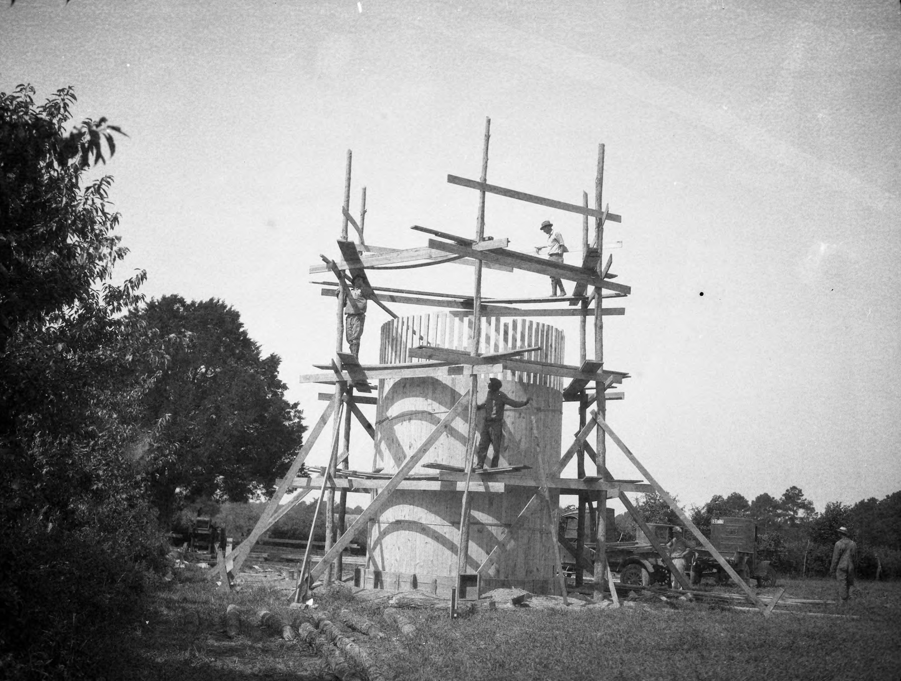
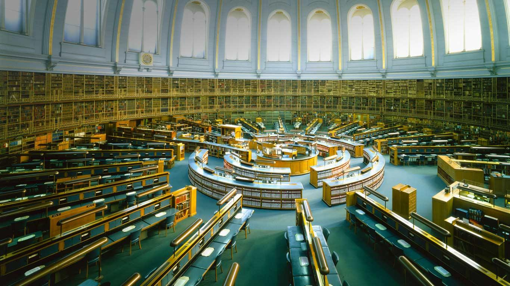

Contrary to oft-repeated wisdom, the internet isn't written in ink. Physical ink on paper is often a far better method for carrying data forward into the future. Manuscripts that are hundreds and even thousands of years old are still with us, and still being discovered every day. Will the same be true of our own data a hundred years from now? 

Physical collections benefit from their form: by taking up space in the real world they demand attention and care. Digital collections more easily fall into the trap of "out of site, out of mind". How many online services have you signed up for, added data to over time, and then later forgotten about? How much of our data, the traces of our lives online, are permanently lost?

It's amazing how fragile we've let our data become. When I hear about someone who loses a device and with it their entire digital photo collection (if not backed up), I consider it a tragedy. Photo albums used to be sacred heirlooms, passed down through generations to remind us all that we come from certain people and places. Now we turn over all of that data to a custodian like Apple or Google, and we don't think about whether their stewardship will continue throughout or beyond our lifetimes. Will Apple exist and still be storing my photo library in 100 years? Even if the data exists somewhere, will there be a way for me to access and view it?

I worry about this especially for those of us who aren't chronically online or attached to their devices, who might not understand the effects of fragmentation and walled gardens might have on them in the future, and who don't have the foresight or knowledge to protect their data for the long haul. 

Even digital artifacts that are preserved are still lossy in an important way. When looking back at the work of creatives from the past, we can trace their process through a series of physical artifacts that lead up to a final work. Digital files are often "flattened" representations of a creative process, capturing the final state but missing the messy middle. Another way our digital legacies are flattened is through the loss of metadata. Traditional filesystems lack standard ways of capturing the context around files: why they were created, by whom, how they relate to other files, what topics they pertain to, etc. 

 

It feels more important than ever in a future with LLMs that we not only control our data, but that we all maintain our own sort of wildlife preserves made up of content unspoiled by computer generation. Over time I expect original, unique datasets will become a commodity for those looking to train models.

Managing our data has only gotten more difficult as personal computing has gotten more sophisticated. So much of our digital lives have moved from our machines and into the cloud. Our documents, photos, and music used to exist on our devices where they could be backed up and preserved, but now they exist more and more in privately-owned corporate silos. 

It's no surprise that we turn to these tools. Organizing and browsing the masses of data we generate is not a task well served by modern operating systems. People love online tools like Notion, Airtable, and Google's suite of apps because they make it easy for consumers to organize data in a way that makes sense to them. They make it searchable, shareable, and available everywhere. But this power comes at a cost: we hand our data over to privately-owned silos whose long term existence is far from guaranteed. 

Sure, you could store all of the same data on your computer as you could in a tool like Notion. But I think the *metadata* those tools allow for is what is so important to preserve. A folder full of files is limiting compared to the database-ness of something like Notion. 

In order to properly organize, retrieve, and preserve massive amounts of data (which we all generate nowadays simply by being online) we need ways of tagging, commenting on, sorting, filtering, slicing, linking, searching, etc. A folder is static, representing one way of looking at data, but most information is useful in many contexts. 

The rise of graph and database-like features in popular tools like Notion or Obsidian is a sign that the simple filesystem has failed us. And that failure has pushed us towards other solutions which require sacrificing ownership of our data. 

If an average consumer wanted to organize information like they might in Notion while maintaining ownership and storing their data locally, I literally do not know of a solution that doesn't involve administrating a database. That's crazy, right?

I'd love to see these sorts of use cases solved for at an operating system level. Third party apps have been a great way to experiment with new computing primitives, but at some point those primitives need to exist without the compromise of giving away control of our data. A simple, hierarchical file structure just doesn't cut it when it comes to organizing and making use of the massive amounts of data we accrue simply by being a human on the internet. 

What might that look like? I'm not sure, but taking cues from relational and graph databases is probably a good place to start. Imagine databases a la Notion as a first class feature of your operating system. A GUI built in to browse and organize a vast repository of data, and programmatic ways for 1st and 3rd party apps to hook into. 

One place we might take inspiration from is Userland Frontier, an object database and scripting environment for both native and web applications. Frontier made it easy to create your own software, using your data, on your terms.

At the center of Frontier was [its object database](http://scripting.com/frontier5/stories/manual/chapter06.html), a set of nested tables that could contain data, scripts, bespoke UIs, and, of course, other tables. The object database could be browsed visually via an app, and accessed easily in scripts where you could persist data to disk as easily as setting a variable.

Frontier was first and foremost a developer tool, but I think the ideas contained therein are powerful for average consumers as well. I keep using Notion as an example, but it demonstrates perfectly how these ideas could resonate beyond developers. 

Brent Simmons, a developer who used to work at UserLand, [wrote about the history of the company](https://inessential.com/2014/05/24/what_happened_at_userland.html) and gives a great summary of Frontier.

> It’s inherently geeky, since it’s a developer tool. But at the same time it’s more accessible than text editor + command line + Ruby/Python/whatever. It can give more people a taste of what power on the internet is like — the power to create your own things, to re-de-centralize, to not rely on Twitter and Facebook and Apple and Microsoft and Google for everything.

Our computers should be databases! We should be able to script them, access them using browser APIs, browse them via a first party application, etc. They should accrue data and knowledge over the course of our lifetimes, becoming more useful as we use them. They should be ours, something we can control and back up and preserve long after we're gone.

Bespoke software, created on the fly is becoming increasingly common thanks to AI. But software is only as useful as the data it's able to operate on.

All of our emails, recipes, playlists, text messages, Letterboxd reviews, TikTok likes, documents, music, photos, browser histories, favorite essays, ebooks, PDFs, and anything else you can imagine should be something we can own, organize, and eventually leave behind for those that come after us. An archive for each of us. 
