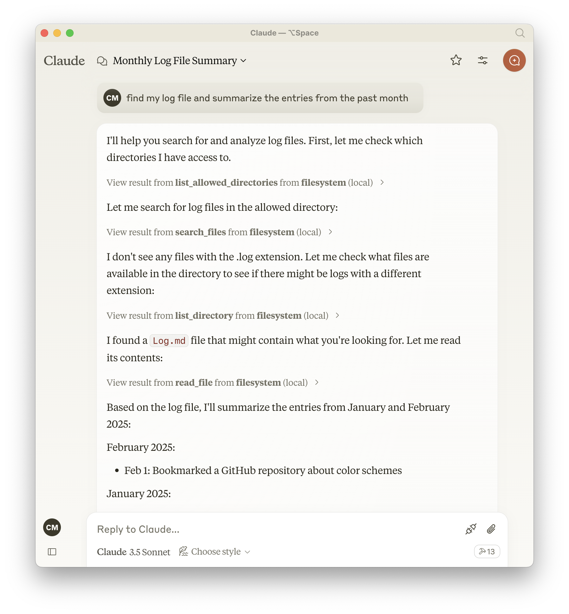

--- 
title: The Model Context Protocol
---

I really enjoyed [this writeup from Matt Webb](https://interconnected.org/home/2025/02/11/mcp) about extending AIs using Anthropic's proposed [Model Context Protocol](https://modelcontextprotocol.io). In its own words, MCP is "an open protocol that standardizes how applications provide context to LLMs". 

Back in 2023 [I wrote a bit about an early attempt at something similar by OpenAI](https://chsmc.org/2023/03/eyes-and-ears) and was pretty excited about the potential. MCP takes things to another level by making it an open protocol. Anyone can host an MCP server, or create a custom client that works with any language model. 

Protocols are cool! And it's fun to explore them. So I wanted to get a sense of MCP for myself.

I was pleasantly surprised by how easy it was to get started with and see the potential of MCP servers. You don't even have to build your own as there are lots that have been built and shared by the community. [Here's a great list of reference servers](https://github.com/modelcontextprotocol/servers) by Anthropic, and there are also *over a thousand* [open source servers](https://glama.ai/mcp/servers) available.

If you do want to build your own, I recommend checking out [this video from Cloudflare](https://www.youtube.com/watch?v=cbeOWKANtj8) on how to get started using their open source [workers-mcp](https://github.com/cloudflare/workers-mcp) package.

But to quickly get a sense of the potential of MCP, I recommend checking out an existing server first. I decided to start by exploring [the Filesystem MCP server](https://github.com/modelcontextprotocol/servers/tree/main/src/filesystem) which is exactly what it sounds like: a server that gives an LLM access to your filesystem through various tools like `read_file`, `list_directory`, `search_files`, etc. This is great place to jump in and see the potential of MCP. 

Adding the server to Claude's desktop application (one of several clients that currently support the protocol) is as simple as dropping this into the app's config file:

```json
"filesystem": {
  "command": "npx",
  "args": [
    "-y",
    "@modelcontextprotocol/server-filesystem",
    "/Users/chase/Notes"
  ]
}
```

All this is really doing is allowing the LLM to run an npm package which implements an MCP server. Neat! 

After restarting the Claude app, I was off to the races. I use [Obsidian](https://obsidian.md) as my personal knowledge base, and the great thing about it is that it stores notes as plain text on the filesystem. Combined with the filesystem MCP server, I could now ask Claude about my own notes. 

Here's a screenshot from my very first time using the filesystem MCP server in Claude. I asked it to find my log file (the file I use for running notes throughout a year) and summarize the entries from the past month:

<div style="margin-block: -1rem -2.5rem;">



</div>

What's fascinating here is the chain of thought the model goes through, and how it uses the tools exposed via the MCP server to solve problems. It starts by searching for files with a `.log` extension, doesn't find anything, and thus broadens its search parameters and tries again. It's then able to find and recognize my `Log.md` file, read its contents, and summarize them for me. Neat!

I'm really excited about the potential here to make computers more malleable for the masses. There's been a lot said about the ability for non-technical folks to create their own apps using LLMs, but the ability for those LLMs to manipulate data and interact with APIs themselves might even reduce the need for a lot of dedicated apps entirely. 


