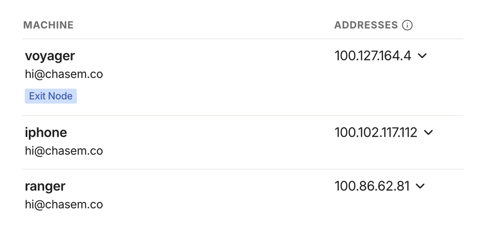
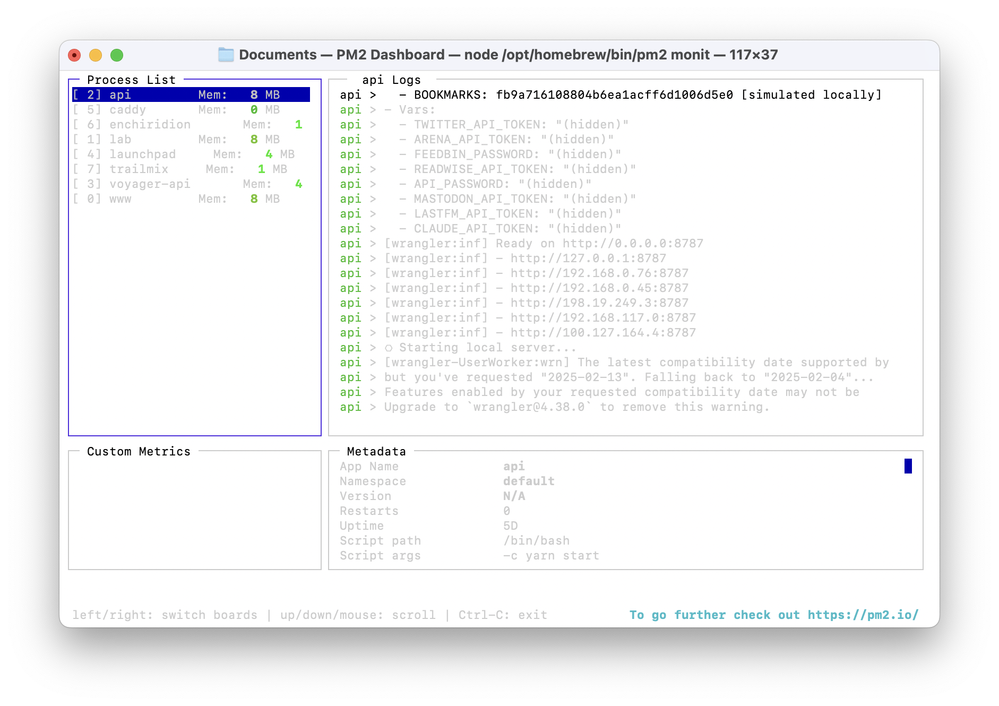

An irony of the personal computing revolution is that, while everyone has a supercomputer in their pocket, a majority of our actual computing has moved to machines in the cloud that we neither own or control.

This surely has some benefits: apps and data are available anywhere and instantly in sync across devices, users are less likely to lose any of their data if their physical device is lost or damaged, and consumers don't have to worry about the maintenance and upkeep of complicated software. 

[I've written before](https://chsmc.org/2025/01/archivists) about the importance of taking ownership of our digital lives. There is indeed a power waiting to be claimed by those who are willing to trade some of those aforementioned benefits for a computing environment that they control.

The web browser is something of a great equalizer here: a universal surface for running and accessing software on any device; the stability of the platform and the ubiquity of its distribution mechanism is unrivaled by the postal service alone. You would expect, then, that the web would be the perfect platform for private, personal software that is owned and controlled by individuals. Unfortunately, that's often not the case!

Running personal software on the web is a trade off between privacy and ownership. Don't want anyone to access your private data? You'll need to implement some sort of authorization scheme and security mechanisms to ensure your data is only accessible to those you trust. Don't want to manage all of that yourself? Then you'll need to use a platform owned by someone else that does it for you. 

Why is it so hard to scale _down_ on the web? What if there were a better middle ground? Well, dear reader, I'm here to tell you that I've found one. 

Imagine: a computer you own, connected to a private cloud, accessible anywhere (for free!), running software on your behalf. All of this is easier than it sounds to setup and maintain if you use the right tools. In this piece I want to share how I've set this up for myself using a spare Mac mini. 

")

What is a cloud computer good for? Lots of things! Here are just a few examples:

- Run your own software and host your own web apps.
- Host web apps for your family and friends.
- Use [Homebridge](https://homebridge.io) to do cool smart home stuff.
- Store and stream your own media library.
- Set up automations to organize emails, files, and more.
- Serve as a Time Machine backup destination.
- Run your own local LLMs or MCP servers to plug into other AI tools.
- Have access to a full computing environment on the go from a tablet or smartphone.
- Anything else you might dream of doing with a computer that's always on and available.

Hardware wise there are lots of options for hosting your own cloud computer, but I happen to think Apple's latest [M4 Mac mini](https://www.apple.com/mac-mini) is a superb choice, especially if you're already familiar with MacOS. It's shockingly small, whisper silent, plenty powerful, and well priced at a starting point of $599.

This guide will focus on how you can take an off the shelf Mac mini (or really any Mac)and run your own web software that is accessible through a web browser to you and you alone. We'll make use of just a few free-to-use dependencies.

## Configure your Mac 

Running a Mac mini as a headless server means we won't have it connected to a display or keyboard during normal operations. You will, however, need to connect those accessories for these initial steps to set up remote access. I've outlined the steps below, and once you have these settings configured you can disconnect the monitor and keyboard permanently.

It's worth noting that as a side effect of making your Mac remotely accessible we'll need to change some settings that make your machine less secure to anyone who is able to access it physically. Be sure your device is kept somewhere secure and can't be accessed by any bad actors. 

- **Turn on remote management and login**
  - Before we enable the ability to access our cloud computer from outside our home network, we first want to set up local remote access so that we can connect to the Mac mini from other devices.
  - Navigate to _System Settings → General → Sharing_
  - Toggle on File Sharing, Remote Management, Remote Login, and Remote Application Scripting.
- **Startup automatically after a power failure**
  - Navigate to _System Settings → Energy_
  - Toggle on the following settings: 
    - Prevent automatic sleeping when the display is off 
    - Wake for network access
    - Start up automatically after a power failure
- **Automatic login**
  - This makes sure that if the machine reboots it will automatically bypass the user selection screen and log in as whichever user you choose.
  - Navigate to _System Settings → Users & Groups_
  - Select a profile next to "Automatically log in as"
- **Never require password to log in**
  - Navigate to _System Settings → Lock Screen_ 
  - Select "Never" for "Require password after screen saver begins or display is turned off." 
  - Select "Never" for "Start Screen Saver when inactive"
- **Enable file sharing**
  - This allows us to access the filesystem of our Mac mini and any connected drives remotely.
  - Navigate to _System Settings → General → Sharing_
  - Toggle on File Sharing
- **Disable automatic updates (Optional)**
  - This step is optional, but I prefer to update my Mac mini server manually during a monthly maintenance routine.
  - Navigate to _System Settings → General → Software Update_
  - Click the info icon next to "Automatic updates" to configure your preference.
- **Enable Time Machine server (optional)**
  - If you'd like to use your cloud computer as a Time Machine backup destination for other Macs, you can do so by following [these instructions](https://512pixels.net/2023/09/how-to-set-up-time-machine-server-ventura-or-later).

Once these settings are configured you should be able to connect to and control your Mac server from another Mac, which is helpful if you choose not to keep a monitor and keyboard connected to your server. 

To remote in to your server, open Finder on another Mac and press Command–K to “Connect to Server.” Enter `vnc://` followed by the Mac mini’s local name or IP (e.g., `vnc://macmini.local` or `vnc://192.168.1.42`) and choose “Share Screen.” If you’ve set automatic login, it’ll drop you straight into the desktop; otherwise, sign in with your user credentials. 

This works for connecting to your Mac over your home's local network, but what about accessing it remotely when you're away from home? Next we'll setup a tool that will take care of that for us. 

## Set up Tailscale

A cloud computer is only useful if you can access it from anywhere, at any time. Ideally we'd like to be able to access software running on our home server over the internet just like any other web app.

This is where [Tailscale](https://tailscale.com) comes in. Making your Mac accessible over the open internet is a dangerous endeavor that's easy to get wrong and comes with a host of security issues. Tailscale works around all of that by giving us a virtual private network over which our machines can connect securely, without allowing access from the open internet. 

Thanks to Tailscale's client apps on Mac and iOS, we can connect to our VPN from anywhere and access our cloud computer as if it was any other web server (even though it's not exposed publicly).

Lucky for us, Tailscale is a breeze to set up and completely free for the purposes described here. There are other tools out there that serve the same purpose, but I've been very happy with Tailscale. It's one of those magic bits of software that just works without any fuss.  

Getting set up with Tailscale is simple:

1. Go to tailscale.com and create an account.
2. Download/install the client application onto your Mac mini server and sign in. 
3. That's it!

Well, almost. You'll also want to do the same on any other devices that you use so that they can connect to the VPN and access your cloud computer. And you'll want to ensure that the Tailscale app is set to launch on login via its settings panel.

Voila! You now have access to your Mac from anywhere in the world. Tailscale will assign each device on the network with a unique domain name that looks something like `machine-name.tail1234.ts.net`. 

This URL can be used to access your Mac mini remotely via screen sharing, so you can use another device to connect and manage your cloud computer on the go. 



You can now spin up a web server on your Mac and access it on your other devices using the assigned domain name combined with the port. Later I'll discuss how to set up custom domain names for your services so you don't need to remember what's running on which port.

You can also now screen share and remotely control your Mac from anywhere in the world. Simply repeat the steps mentioned above, but replace the local IP or hostname in the `vnc://` address with the ones provided by Tailscale. 

## Manage and access your software 

Now that your cloud computer is set up and accessible remotely, it's time to put it to use! 

Any app running on your machine that is exposed on a local port will be accessible over your Tailnet, but we need to make sure that those apps are always running and restart automatically if, say, our machine reboots or the app crashes. For this, we'll use a process manager called [PM2](https://pm2.keymetrics.io).

Start by installing PM2 globally using npm: 

```sh
npm install pm2@latest -g
```

Next, we'll create a PM2 configuration file that specifies the apps we want to run and manage. Execute the following command to generate an `ecosystem.config.js` file:

```sh
pm2 init simple
```

That will create a JavaScript config file called `ecosystem.config.js` in the current working directory. It doesn't matter too much where you store this file (mine lives in the home directory). The file contents will look something like this:

```js
module.exports = {
  apps: [
    {
      name: "app1",
      script: "./app.js"
    }
  ]
}
```

The important bit here is the `apps` array that contains objects representing the services we want to run and manage. Each app, at the very least, will have a name and a script that should be executed to start the app. 

Here's an example config for one of my apps:

```js
{
  name: 'api',
  cwd: '/Users/voyager/Repositories/api',
  script: 'yarn start',
}
```

This tells PM2 to run `yarn start` within the directory specified by `cwd` (current working directory) whenever starting the process. 

Once your PM2 config file is ready to go run `pm2 start ecosystem.config.js` to start up all of the apps defined therein. Swap the `start` for `stop` there to stop all of your apps. Check [the PM2 docs](https://pm2.keymetrics.io/docs/usage/application-declaration) for all of the available options and commands.

Now that we've told PM2 about our apps, we need to make sure it's configured to start them whenever our Mac reboots. PM2 makes this easy—run the following command:

```sh
pm2 startup
```

This will output a terminal command that you'll need to copy, paste, and run. Once that's done, PM2 _itself_ will be set up to run whenever your machine boots. 

Finally, we need to tell PM2 which apps should be restored on reboot. Luckily, the config file we created defines all of these, so we'll just start PM2 with that config and then save the list of current processes:

```sh
pm2 start ecosystem.config.js
pm2 save
```

If you ever make any changes to your config file, you'll want to repeat this step to ensure those changes are picked up by the launch daemon. 

PM2 comes with a great terminal UI for observing the status of your running apps which you can access by running `pm2 monit`. I like to keep this running in a terminal window on my Mac mini so I can see the status of my apps at a glance.



## Custom domains (optional)

The last step in perfecting this setup is to assign custom domains for the apps hosted on our cloud computer. This is nice because we won't need to memorize or keep track of which app is running on which port number. 

There are many way to get this to work, but the solution I found to be the most straightforward uses a combination of Cloudflare as a domain registrar and a reverse proxy tool called [Caddy](https://caddyserver.com).

You'll need a domain name registered on Cloudflare that that you'd like to use for your cloud computer. Separate apps/services running on the machine will be assigned to subdomains.

### Configure DNS

The first step in this process is to point our domain on Cloudflare to the IP address of our server on Tailscale. Navigate to [the Machines tab in your Tailscale dashboard](https://login.tailscale.com/admin/machines), find your server in the list, and copy the IP address assigned to it by Tailscale. We'll need that address for the next step. 

Next we'll update the DNS configuration of our domain to have it route to our machine on Tailscale. In the DNS records panel for the domain, create a new A record pointing to the IP address you copied from Tailscale. Use the domain name for the "name" field, and be sure to uncheck the option to proxy through Cloudflare's servers.

### Install and configure Caddy

Caddy will proxy requests to our machine to specific ports, and will take care of setting up an HTTPS certificate for us. 

You'll need to download and install Caddy with the Cloudflare DNS plugin, which can be found [here](https://caddyserver.com/download). Select the appropriate OS/platform, search for and select the `caddy-dns/cloudflare` plugin, right click the Download button, copy the URL to your clipboard, and use it within the following commands.

```sh
# Download Caddy with the Cloudflare plugin
# Replace the URL with the one you got from the Caddy downloads page
sudo curl -o /usr/local/bin/caddy "https://caddyserver.com/api/download?os=darwin&arch=arm64&p=github.com%2Fcaddy-dns%2Fcloudflare&idempotency=89062609982188"

# Make Caddy executable
sudo chmod 755 /usr/local/bin/caddy

# Verify that Caddy is installed
caddy --version
```

Once Caddy is installed we need to create a Caddyfile to specify which URLs will be reverse proxied to which port running on our machine. Create a file named `Caddyfile`, stick it anywhere on your filesystem, and update it to look something like this:

```txt
(cloudflare) {
	tls {
		dns cloudflare CLOUDFLARE_API_TOKEN
	}
}

lab.chsmc.tools {
	reverse_proxy http://localhost:3000
  import cloudflare
}

api.chsmc.tools {
	reverse_proxy http://localhost:8000
  import cloudflare
}
```

You'll need to replace the `CLOUDFLARE_API_TOKEN` string with an actual API token acquired from Cloudflare. Navigate to [Cloudflare's API token page in profile settings](https://dash.cloudflare.com/profile/api-tokens) and generate a token that has zone DNS edit permissions. This step allows Caddy to connect to Cloudflare via its API to ensure SSL certificates are automatically set up for our domain.   

In the example above, subdomains of the root domain (for me, `chsmc.tools`) are reverse proxied to specific ports on localhost. You'll of course want to update this to match your domain and the ports on which your processes are running.

Finally, we'll update our PM2 config to include Caddy as one of its managed processes. In the `apps` array within the PM2 config file we created earlier, add the following:

```json
{
   name: "caddy",
   cwd: "/Users/chase/Documents",
   script: "caddy stop || true && caddy start"
}
```

Make sure the `cwd` property points to wherever you saved your Caddyfile. 

<hr class="break" />

While it requires some initial setup, I've been very pleased with this solution both in terms of its usefulness and how little maintenance has been required after getting up and running. I've had virtually no down time or cases where my server was inaccessible for any reason, and I only do maintenance about once a month to update the OS, the software running on the device, etc.  

It's also pleasing to know that all of this is running on a machine in my home. There's something really satisfying about the knowledge that an increasing part of my daily toolkit is code I wrote running locally on a happy, humming machine in my apartment.

The point of all this isn’t to replace the open web: it’s to create a low‑friction space, a laboratory, where we can experiment with and run software without the headache of sign‑up flows, hosting providers, authorization, dependency overload, or vendor lock‑in.

I started by using my cloud computer to run a couple of scripts, but over time I've built up such an arsenal of tools that my little machine feels in many ways like more of a companion than the computer I carry in my pocket every day. 

For me, perhaps even more than AI coding tools and app builders, this bit of kit has made software feel more malleable and approachable than ever.
