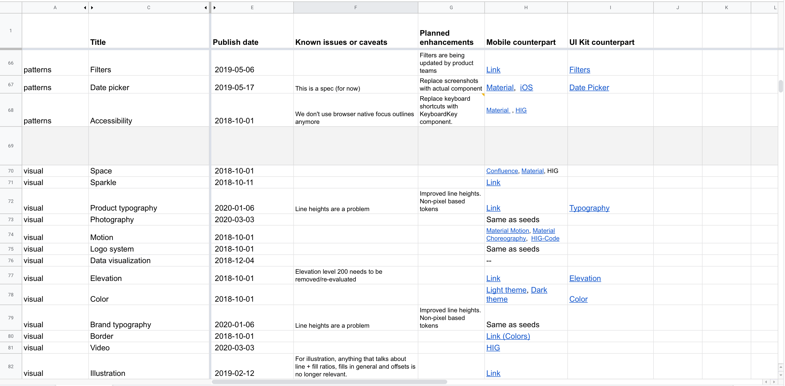
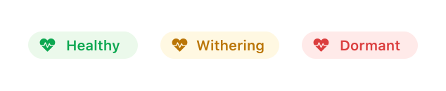
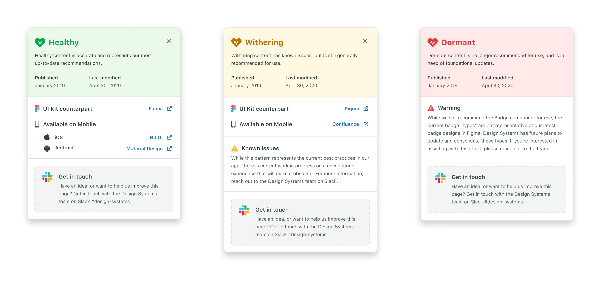
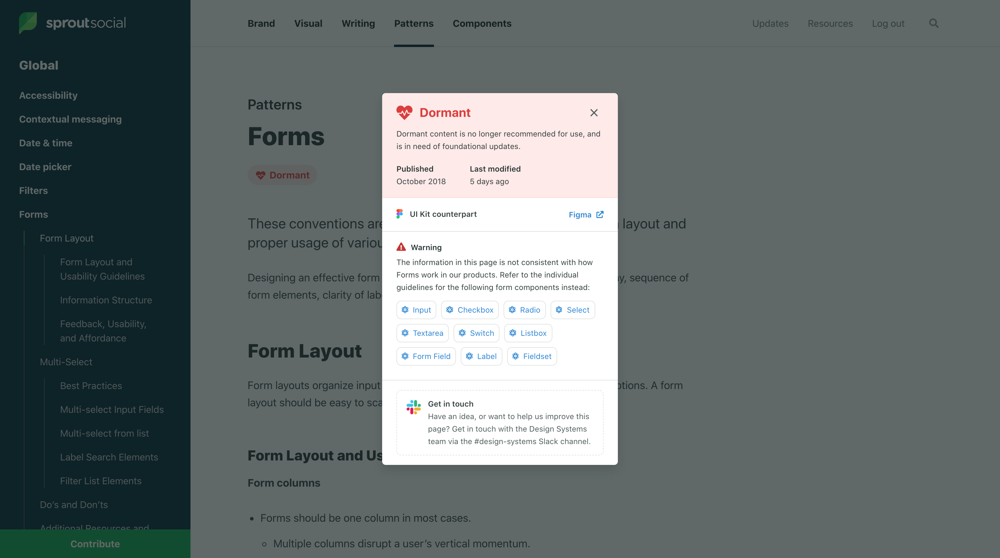

<Callout>
  <b>Note!</b> This article was <Link to='https://medium.com/sprout-social-design/design-system-health-3004551060f0#0cc5'>originally published on the Sprout Social design blog</Link>.
</Callout>

Design systems are a lot like community gardens. Everything in a system has a natural life cycle that begins with a human need, eventually grows into a fully-formed component or pattern, and (if nurtured) evolves over time.

System practitioners spend a lot of time focused on the beginning of this life cycle—how does the content of our system come to exist? How does it find its way into the system, and how can our communities play a key role in that process? We sometimes spend so much time focused on the early parts of this lifecycle that we forget to account for how content grows and evolves within our system.

At any given time, a garden may have plants that are flourishing and plants that are withering or dying. Likewise, a design system may have some content that captures the latest and greatest thinking around your product or brand, and some content that may no longer be accurate.

While it might be uncomfortable to acknowledge that everything in your system is not accurate, out-of-date content is a reality for any design system that supports an actively evolving product or brand. Acknowledging and planning for this is important for both the team managing your design system, and the users of that system. Without understanding the health of our system, the teams responsible for their upkeep can’t accurately prioritize work to maintain them, and our users lack confidence because healthy content is treated and presented the same way as out of date content.

Of course, understanding the health of a garden is a lot easier than understanding of the health of a design system. Plants visibly wither and die, whereas design patterns and guidelines slowly become divorced from the implementation they are intended to support.

Sprout Social’s design system, [Seeds](https://seeds.sproutsocial.com), has matured and grown significantly over the past year. In order to ensure we can continue to grow in a responsible way, my team recently set out to paint a clearer picture of the health of our design system for our own purposes, and for the benefit of our users.

## Defining health

In order to surface content health in Seeds, we had to first develop a shared definition of what “health” means for content in a design system. This was by far the most challenging aspect of the project, because there are so many factors that can influence health. In fact, this definition will likely be unique to every design system.

In this case, it was helpful for us to work from the outside in by defining the extremes of health in our system. This made things a lot more clear—we know that the positive extreme is simply healthy, up-to-date content, and the negative extreme is removing a piece of content from the system entirely. Of course, there’s a lot of nuance between those two extremes. How do we separate content that doesn’t fall into those buckets, and how much of that nuance do we need to expose to our users? For the answers to those questions, we asked them directly.

We ran a brainstorm with some of our users where we asked them to think about what factors might determine the health of content in our system. Our goal was to determine which “vital signs” our users look for when they are consuming our system. Here are some of the broader themes that we discovered:

- **Times, dates, and people.** Consumers want insight into the history of content in our system—when was it created, when was it last updated, and by whom.
- **UI kit availability**. Lots of designers attributed the health of a component to whether or not it was represented in our Figma UI kit.
- **Cross-platform availability**. While our design system is currently focused on our web products, we do have lots of internal documentation on our mobile products that have not yet made it into the system. Our users think of patterns or components with mobile counterparts as being more healthy.
- **Usage information.** This theme is essentially “how often and where is this component or pattern used in our product(s)?” Frustratingly, this metric is one of the most difficult for our team to measure (as I am sure is true for many system teams).
- **Known issues and planned enhancements.** Our design system team has a clear sense of where the system is lacking, and what work is currently ongoing or planned. Our users, however, wanted more insight into that information.

We then took these themes and broke out every discrete piece of relevant information that could be tracked and surfaced, based on the type of content in our system. Unfortunately, we had to filter out any vital signs that were not currently possible for us to track. Most of these were related to when and where in our products a certain component/pattern is used—although this didn’t make it into our v1 solution, we have plans for how we could track and surface this in future iterations.

In the end, we decided on the following vital signs to track for our first iteration:

- **Publish date**
- **Last modified date**
- **UI kit availability**
- **Mobile counterpart**
- **Known issues**
- **Planned enhancements**

In addition to these vital signs, we also decided to rate each page in our system with an overall health status, which I’ll discuss more in a bit. That status is based on these vital signs, and so it was important that we gathered this data before making decisions around status.

As is common when working on a design system, we turned to a spreadsheet for this. We inputted every page of our system, and created columns for each vital sign we needed to track down.

Luckily, tracking down the **publish date** for all our content was easy—since our system’s content lives in GitHub, we simply had to look at the content’s commit history to see when it was first added.

The **last modified date** was a bit trickier. Finding the date isn’t a problem (GitHub again), but manually tracking and updating these dates as content changes seemed like too much overhead. We wanted our health tracking system to be as effortless as possible, without adding extra burden for us to maintain over time. Enter the magic of [serverless functions](https://www.netlify.com/products/functions/)…

I was able to write a function (hosted on [Netlify](https://www.netlify.com)) that queries the [Github API](https://developer.github.com/v3/repos/commits/#list-commits) to retrieve the date of the last commit for a given file path. Now, instead of tracking last modified dates manually for every page in our system, Seeds instead queries for this date automatically. This means it’s always accurate, and our team doesn’t have to think about updating the date whenever we modify content.

For tracking down **UI kit and mobile counterparts**, we turned to our teammates. We asked the domain experts across our teams to help us gather up links to components in our Figma UI kit and mobile documentation in our internal wiki, as well as system documentation from Apple’s Human Interface Guidelines and Google’s Material Design guidelines for instances where we default to system behavior. During this process, we asked those experts to identify whether missing content was something that needed to be added to our system, or if it was inapplicable to the system. For instance, our [Stack](https://seeds.sproutsocial.com/components/stack) component has no counterpart in Figma because it’s a layout utility. However, this being missing does _not_ indicate that Stack is less healthy than other components that do have counterparts in our UI Kit. Context is king when communicating the health of something as nuanced as a design system.

Finally, **known issues and planned enhancements** were the easiest for us to source because the design systems team knows our system intimately, including its shortcomings and roadmap. Our team sat down to go through every page together and list out the major issues and work we knew was planned or in the works. For our partner content, like writing and brand guidelines, we reached out to those teams directly to have them weigh in.

Collectively, these vital signs painted a clear picture of the health of our system. The spreadsheet alone would have been a useful resource for both our team and our stakeholders, but we knew that a much more powerful solution would be to surface this information contextual, within the system itself.

## Communicating health

When planning this project, we discovered that there were two primary user needs we needed to fulfill when surfacing health in our system:

- Users need a **stop/wait/go** signal when evaluating whether or not to use some part of our system.
- Users need **research assistance**. When scrutinizing content in our system, users want rich information to assist in their investigation. Contributors to the system likewise often need a reference point when making updates and evolving content.

Each of these needs are on the opposite end of the interaction spectrum—the former is a quick signal that should immediately communicate the proper status to the user, while the latter is much more involved and requires intent from the user.

Due to these contrasting needs, we decided to break content health down into two parts:

- A **health label** that quickly clues the user into the general health of some piece of content. This status not only indicates health, but also serves as an indicator for users browsing content in Seeds—should they continue reading, or is there reason to stop and investigate?
- A **”scorecard”** that includes a variety of metadata and information to help users understand health, and to prompt them to contribute to the system directly.

### Health labels

Quickly communicating health is surprisingly challenging—there are a huge pool of metaphors and ideas to pull from. For instance, how might we quickly communicate that something is in good health? Here are just some of the words we might use:

- Mature
- Fresh
- Healthy
- Strong
- Good
- Active

Our team spent a lot of time evaluating language to find just the right terms. We avoided words like “mature” that falsely associated age with health—some content in a design system is naturally more evergreen than others, and age doesn’t paint a complete picture of health. We also avoided words like “dead” that are overly harsh and insensitive.

In the end, we landed on the following status labels, which just happen to fit into the plant theme we have going on at Sprout:

- **Healthy** indicates content that is accurate and represents our most up-to-date recommendations.
- **Withering** indicates content that has known issues, but is still generally recommended for use.
- **Dormant** indicates content that is no longer recommended for use, and is in need of foundational updates.

While the “healthy” and “withering” statuses are relatively straightforward, “dormant” may not be as obvious. Initially, our idea was to only have two statuses—healthy and withering. Our rationale was that any page that was beyond withering, and no longer recommended for use, would simply be removed from the system altogether until updated content could be created.

Once we got around to actually assigning statuses to our content, however, this quickly became a problem. Were we really prepared to delete all of the content in our system that had become obsolete? Again, one of our user needs was to assist contributors with research into the contents of our system. Understanding where a pattern came from and how it developed can be crucial to evolving it. If we removed the dormant pages from Seeds altogether, we would be depriving ourselves and our users of opportunities to contribute.

Thus we decided to have a third status for content that is out of date (no longer recommended for new work), but _should exist in the system in some capacity_. These dormant pages represent concepts that are fundamentally valid, and they serve as a placeholder for future work as well as a historical record for the contributors doing that work.

If dormant pages have some future in the system, what about pages that don’t? In our audit, we did identify content that represented patterns that are abandoned altogether, or that were created for temporary features or campaigns. Since these no longer had a place in our system, we quietly removed them.

### Scorecards

While the status label serves the purpose of quickly indicating health to our users, the content scorecard gives them access to the vital signs that informed the team’s decision on whether that content is healthy, withering, or dormant.

Scorecards open up as a modal on the page when the user clicks the status label. The contents of a scorecard depends on what is applicable for the page it represents, but all scorecards show the status label, a description of what that status indicates, the published and last modified dates for that content, and a call to action that serves to drive contribution to the system.

For pages representing patterns or components that should have mobile or UI kit counterparts, we display that along with links directly to those resources if they exist. If something is missing, we intentionally display that as an indicator that there is work to be done.

For issues and planned enhancements, we decided to allow the content to be free-form (versus the other vital signs that are displayed the same way across every scorecard). This meant that we could craft the content to best serve the context of that page’s specific health issues. This example shows the scorecard for our form documentation, which is dormant, and directs users to alternate documentation that will better serve them:

This flexibility is key, as most pages have very unique problems and considerations that aren’t well suited to a strict template.

We are excited to see how scorecards might evolve in the future as we track more data about the health of our content over time. We also have plans to integrate tools that allow users to submit ideas, feedback, or suggestions directly rather than sending users to Slack.

## Making the data work for us

While not the original goal of the project, having collected so much data for our content does unlock some very exciting opportunities for both the design system team and our users that weren’t possible before.

One of the first things that we built after shipping this project was an internal dashboard for the team to see the health of our system from a bird’s eye view. This page lets us see every page in our system, its status, and its publish date at a glance. It also shows us the total counts for healthy, withering, and dormant pages in our system.

This dashboard gives us an effective “snapshot” of our system’s health at any point in time. Our plan is to monitor and record these numbers over time, with the hope that our system’s health trends up, and giving us a concrete success metric to drive towards.

In the future, we have plans to open this dashboard up to our stakeholders as well so that they can easily see where we are in relation to our goals, and to provide our users with a one-stop-shop for finding opportunities to contribute.

There’s lots of other potential when you are tracking this kind of data. Here are a few ideas we’re exploring:

- **Sending notifications to the design system team when content hits a certain age.** We are imagining a sort of early warning system that prompts our team to maintain and prune the garden that is our system.
- Since we are now tracking the publish date for every page, we can easily determine if a page is “new” (say, less than 30 days old) and **surface an indicator within our system that alerts users to new content they may not have seen yet**.
- Since we are tracking the elements of our system that are represented in both our Figma UI kit and our mobile documentation, we can easily **generate reports for the maintainers of those resources to show them exactly where the gaps are between them and the system**.

We are super excited about what this fidelity of data can do for our system, and we hope to track more and more data over time so that our understanding of our system’s health continues to grow along with the system itself.

## What’s next

We learned from research that one of the biggest barriers for users who want to contribute to Seeds is understanding what our system _needs_. Users are much more likely to actualize their contribution if they feel like they are working towards a well-defined result as opposed to self-initiating a system change.

Our ultimate goal with this work (and the work planned to follow it) is to create a sustainable model of growth for our system. Our design system team is small (2 people), and constantly inundated with feature requests, bug reports, and suggestions for changes to our system that we could never reasonably hope to accomplish alone.

We know what we need to crowd source this work if we are going to keep up with our brand, products, and users as they evolve. Doing so will require us to collect, organize, and advertise the necessary changes to potential contributors in order to connect their desire to participate with an attainable and finite goal. Exposing content health is our first step towards this—we hope that by advertising the gaps in our system, we will provide users with organic opportunities to contribute that they didn’t realize existed before.
