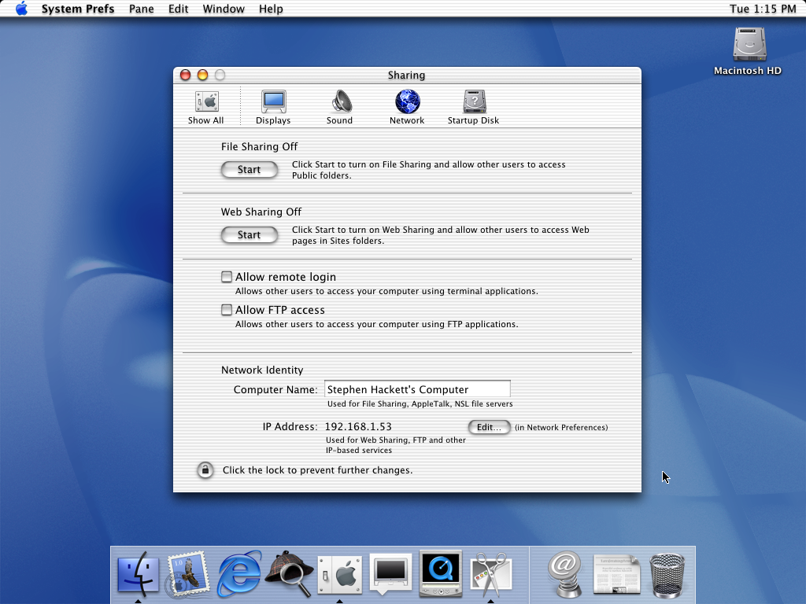

I've been having lots of thoughts lately about the evolution of cloud computing and how the barriers between clients and servers are changing. These thoughts have mostly been inspired by a few recent things out there on the web.

Most recently I stumbled upon [a project by a student named Jeeyoon Hyun called "Personal Pet Pages"](https://itp.nyu.edu/thesis2022/?jeeyoon-hyun) which is a small, personal web server with a screen displaying what's going on inside the server.

> Ever since we’ve decided that servers are something heavy, enigmatic, gigantic black boxes belonging to corporations - not individuals - we have slowly lost agency towards our own small space on the Internet. But actually, servers are just computers. Just as your favorite cassette player or portable game console, they are something that you can possess and understand and enjoy. 
> 
> <cite>[Personal Pet Pages, ITP Thesis Archives 2022](https://itp.nyu.edu/thesis2022/?jeeyoon-hyun)</cite>

---

An increasing amount of personal computing happens on servers nowadays, but we've made hardly any progress on making servers fit into our lives like other devices.

---

Our connections to the internet are a one-way mirror. 

> It’s not impossible to host a small internet service from a computer in your home, but it takes some fairly intense tinkering and maintenance, so it remains the pastime of … the fairly intense. Brittle router admin is no match for the sleek, there-it-is seduction of big platforms and/or cloud data centers.

[Bad hosts, or: how I learned to stop worrying and love the overlay network](https://www.robinsloan.com/lab/bad-hosts/)

> There are workarounds for NAT, ubiquitous hacks, but they all require centralized intermediaries. Think of video chat. While we’re chatting, the video is flowing straight from my computer to yours — in a sense, we are each hosting a small internet service for each other! But we can’t initiate that connection ourselves. It requires a third host, one with a public IPv4 address. That host “punches a hole” through our one-way NAT mirrors and ties us together.

> The workarounds are fine as far as they go, but NAT tricks can’t get us the one thing we really want, the foundational internet thing: the ability to simply listen for connections. Therefore, whole classes of possible services and relationships don’t exist; a whole alternate internet history.
>
> As home internet users, we can only speak and request, not listen and serve.
>
> <cite>[Bad hosts, or: how I learned to stop worrying and love the overlay network](https://www.robinsloan.com/lab/bad-hosts/)</cite>

[Robin has previously written about their love for cloud functions](https://www.robinsloan.com/lab/cloud-study/), and it makes sense why they feel so good—they can listen for connections on or behalf. But we don't own the computers those functions run on. What if we could own personal servers that not only hosts these functions but also let's us see them run, visually, in real time.  

> The Mac and Web have a long history together. From the very beginning, Mac OS X included the ability to run an Apache web server by clicking a Start button:
> 
> 

---

In the early days of the web, constant access to significant computing power was rare. Webpages existed across a few dozen servers maintained by universities, research groups, the government, and, as time went on, web hosting companies. 

Nowadays, we have on-demand access to incredible computing power not only on our client devices, but also on cloud infrastructure that is very cheap to use. It raises two questions: first, is our client devices are so much more powerful now, why aren't we using them as servers? And second, if cloud computing is such a commodity, why are more casual internet users not taking advantage of it as a resource? 

Imagine if the most mundane tasks of your personal or professional life could be outsourced to a cloud function which is there, always waiting to spin into action. Now, imagine you could trust the server doing that work because it's one that you own and host yourself. 

Having access to our own server would mean that we could finally host others in our digital space. As Robin said, we'd be able to listen and serve rather than just speaking and requesting.

Andy Matuschak asked a great question recently:

<blockquote className="twitter-tweet" data-conversation="none" data-dnt="true">
Another way to put this: if Twitter (as it exists today) is the town square, what might it mean to build a public library for that &quot;town&quot;? A coffee house? A dance hall? A university campus?
&mdash; Andy Matuschak (@andy_matuschak) <a href="https://twitter.com/andy_matuschak/status/1518738033075388416?ref_src=twsrc%5Etfw">April 25, 2022</a></blockquote>

I'd like to think that the ability to easily host your own server for fun might be like inviting a friend over to your house in this digital "town" that Andy is imagining.

There are some new, experimental browsers ([looking at you, Arc](https://thebrowser.company)) cropping up that I think could have some exciting impact here. Imagine a browser that allows you to _serve_ as well as browse.