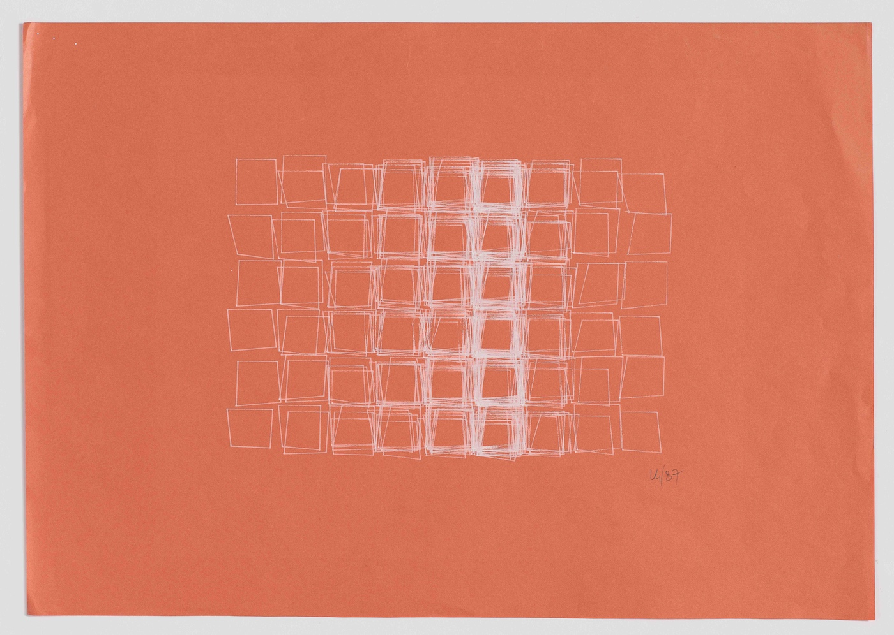
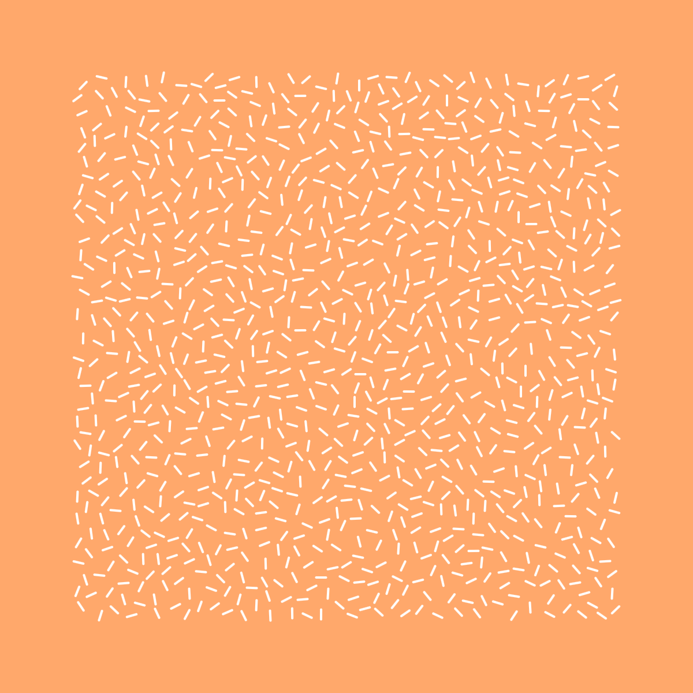

It seems as though everything I gravitate towards in life tends to be at an intersection of art and technology. I spend my days building tools for designers, and thinking about how we design things _for people_ but _with technology_.

Perhaps the most straightforward example though is [generative art](https://en.wikipedia.org/wiki/Generative_art), which seems to be gaining more and more interest in my corner of the internet. I think it's because writing code and/or designing things is so often a means to an end for many of us. Our jobs expect creativity, but demand results.

I've found that exploring generative art has helped me maintain a creative outlet that exists purely in service of making something that delights me. Something like that is all too rare lately.

There have been quite a few excellent resources that have helped me jump into generative art that I would like to share both as a reference for myself, and as a way of lowering the barrier of entry for anyone else who wants to try their hand at creative coding.

## Some history

Generative art as we know it came about in the 1960s and was directly linked to the rise of the computer industry. I love that for as long as computers have existed, there have been people who see their potential for art as well as science.

[George Nees](https://en.wikipedia.org/wiki/Georg_Nees) was one of the first to show off graphics made using computers, and worked on that he called "computer-scultpures" using tools like milling machines and plotters.

Generative art is distinguished from computer-generated art in that it is autonomous to some degree. A generative artist differs from a painter or sculptor in that they are not responsible for every decision that leads to the finished piece.

Instead, generative artists create systems that can make some of the decisions alone. The artists gives the direction, but allows the computer to steer the vehicle.

This leads to a certain serendipity in the finished product. Pieces can be different every time that you look at them, and in many cases will never output the exact same piece twice. The fleeting nature of the work is what appeals to many.

Perhaps the biggest pioneer of generative art is [Vera Molnár](https://en.wikipedia.org/wiki/Vera_Molnár), whose work in the space of computational art still holds up today, even though she was doing work with tools that were comparatively ancient to what we have at our disposal now. I strongly encourage you to [browse through](https://www.artsy.net/artist/vera-molnar-1) [some of her pieces](http://www.artnet.com/artists/vera-molnar/) online.

In one of her most famous series, _Structure de Quadrilateres_, she takes a collection of rectangles and introduces randomness while somehow maintaining a natural rhythm:

If you would like to learn more about Vera Molnár and her works, I recommend reading [this recent piece about her on Hyperallergic](https://hyperallergic.com/437834/vera-molnar-drawings-1949-1986-senior-and-shopmaker-gallery-2018/).

There are so many more amazing generative artists to learn about. For instance, [Sonia Landy Sheridan](https://en.wikipedia.org/wiki/Sonia_Landy_Sheridan) founded a new department called Generative Systems in 1970 at the Art Institute of Chicago. [She has a fantastic website where you can see some of her art and read more about the Generative Systems department](http://sonart.org).

Another piece I'd recommend is [Jason Bailey's post on Artnome titled](https://www.artnome.com/news/2018/8/8/why-love-generative-art) [_Why Love Generative Art?_](https://www.artnome.com/news/2018/8/8/why-love-generative-art) It provides a brief history of generative art and the way that the practice has progressed since its inception.

I encourage you to take some time to appreciate and learn about the people who paved the way for generative art. It makes for an excellent opportunity to find some inspiration for your own work.

## Practical magic

Now that you know a bit of the history behind generative art, I'd suggest jumping in yourself by learning how to create something simple.

There are lots of technologies out there designed specifically for creative coding. Arguably the most famous of those are [p5.js](https://p5js.org) and [Processing](https://www.processing.org). I recommend starting with p5.js because it's built on JavaScript — which a lot of folks already know — and it's easy to get started using it right in the browser.

In fact, my favorite way to create generative art is in [CodePen](https://codepen.io). You can easily add p5.js as a script in your pen, or you can use [this template I created for quickly getting started with a new p5.js sketch](https://codepen.io/chasemccoy/pen/ejexMV).

No matter which tool you use, it shouldn't be too hard to find resources for learning how to draw some basic shapes. One of my favorites is [Daniel Shiffman's video series on creative coding](https://shiffman.net/videos/). Watching along and coding examples from a tutorial is a great way to learn. Daniel even has [a video series that covers the foundations of JavaScript in the context of p5.js](http://youtube.com/playlist?list=PLRqwX-V7Uu6Zy51Q-x9tMWIv9cueOFTFA).

Once you've got the basics down, it's important to start learning how to introduce autonomy into your pieces using loops and noise.

Tim Holman created one of my favorite resources out there for taking your art to the next level. [Generative Artistry](https://generativeartistry.com) is a series of lessons describing fundamental concepts or recreating pieces that teach invaluable skills. I learned the basics of circle packing from the site, and that allowed me to make stuff like this:

I especially love that Tim breaks down how to recreate famous pieces from some of the people I mentioned earlier, like Vera Molnár and Georg Nees.

It's also important to cultivate an environment of inspiration around generative art. I find that because the possibilities of autonomous art are so limitless, it helps me to take a piece that I like and use it as a starting point to riff on.

[Daniel Eden's gallery](https://art.daneden.me) is excellent not only for the pieces themselves, but because Dan accompanies each with a description of the basic logic used to achieve the result. Recreating some of his pieces helped me learn techniques that I have made use of many times since. Dan also wrote [a great piece on how he got started with generative design](https://daneden.me/2016/11/02/drawing-with-numbers/).

Another favorite of mine is Heydon Pickering's [mutable.gallery](https://mutable.gallery), which features sketches that can be re-generated to produce unending, unique permutations. I love how Heydon makes it so easy to share the piece that you generate, making each one feel more special somehow.

Finally, I suggest you follow Matt DesLauriers on [Twitter](https://twitter.com/mattdesl) and [Instagram](https://www.instagram.com/mattdesl_art/). Matt's work is amazing, and he represents the community well by sharing his processes and learnings as he grows.

* * *

I love making generative art because its edges are blurry, and I can step off of them without worrying about technique or execution. Happy accidents are easy to make and often result in some of my favorite pieces.

Ultimately, generative art is about rolling with the punches and letting the medium itself influence the work. I think flexing those types of muscles has made me a better designer overall. Maybe it can do the same for you.
