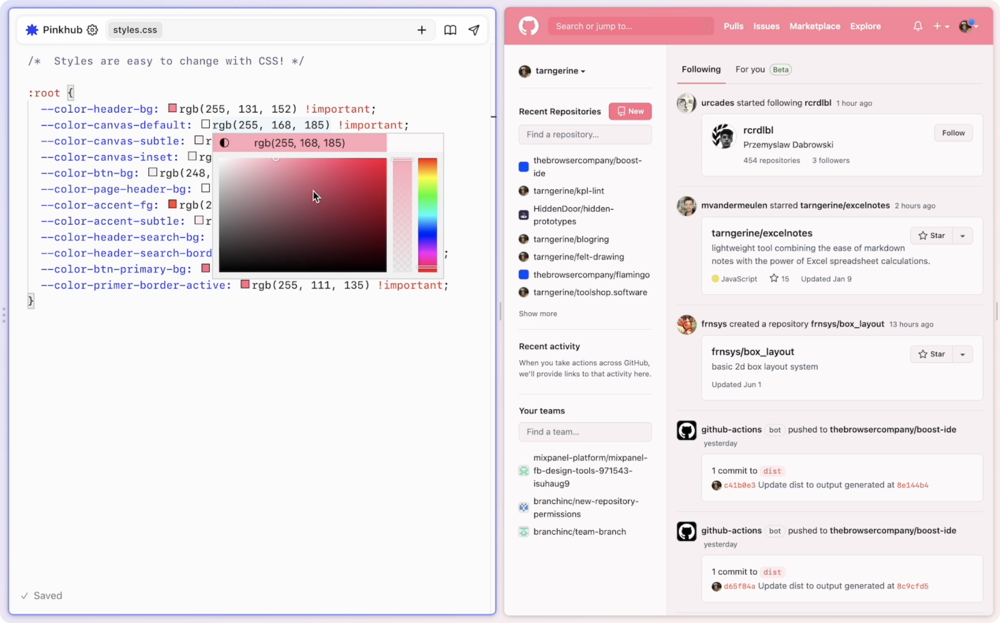

[The Browser Company of New York](https://thebrowser.company/) is building a new web browser called Arc, and they recently shared a preview of a new feature called "Boosts".

Boosts are a built in way to remix the web by writing your own code (HTML, JavaScript, and CSS) that can run on any website or specific ones that you assign. Check it out:

Look at that! The webpage on the right is raw material for the code on the left. They've even built in visual editing tools such as a color picker. 

Webpages have always been destinations, but what if they were more like blank canvases, inviting you to extend and reimagine them in whatever way you see fit? 

It has always been possible to run user scripts and styles via browser extensions, but I've never seen it integrated seamlessly and directly into the browser. Arc even implies that working with the web might be just as important as browsing it—in Arc's interface, the Boost editor sits at the same level as the page you're browsing, not in some nested panel that feels secondary to the experience. 

Under the hood, Boots are just a folder of HTML, JS, and CSS files. You can zip them up and send them to a friend, if you'd like. One can imagine a way to easily share boosts with your friends or even strangers on the web in some sort of marketplace built right into Arc. Entire forums dedicated to sharing boosts around like Winamp skins for websites. 

Another idea that comes to mind for me is bookmarklets and browser extensions. These are powerful tools but creating them is complex. What if you could add functionality to the web by creating your own extension right there in the browser? 

All of these questions and possibilities are exciting, and it’s refreshing that they’re being explored at all by a startup in 2022. 

I’m interested in software that works _for_ us, our creativity, and our attention. The web is a powerful building material with a variety of textures, and it’s time we had tools that let non technical users take advantage of their free access to such an incredible resource. 