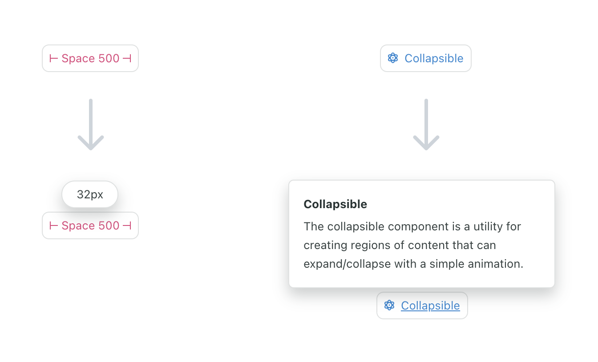
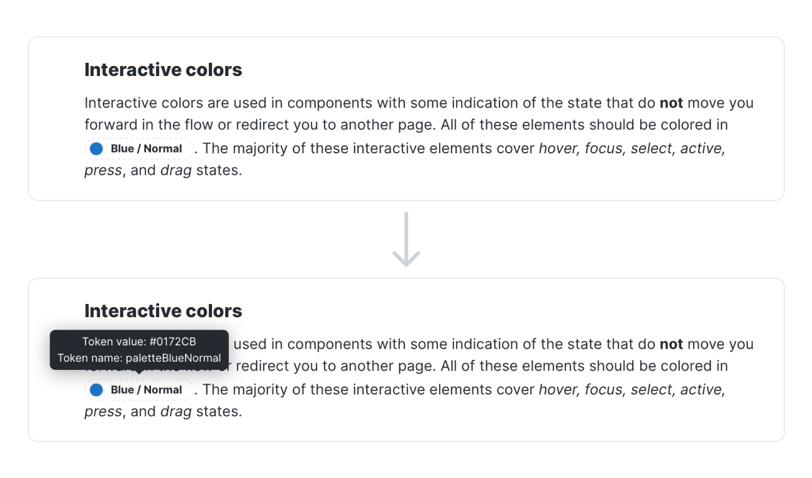
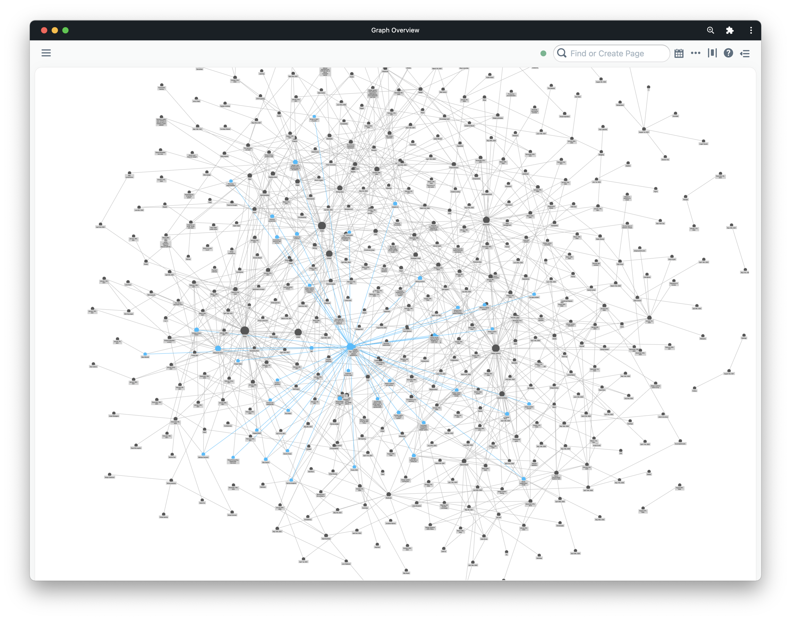
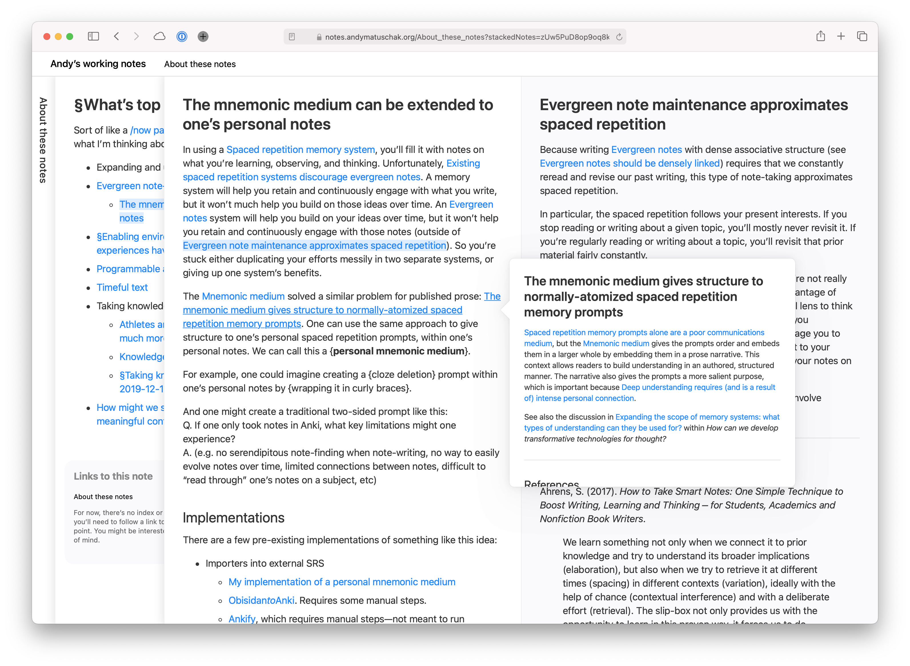

Lately I've been thinking a lot about design systems documentation, and more importantly how we scale knowledge and best practices across a large team. Looking at most system documentation (including for the design systems I've built), you'll see something that heavily resembles the documentation you might find for a standalone product or software library. 

We're used to writing and reading long, linear documents full of content structured from top-to-bottom. But I think that content is actually far more useful in small chunks that are individually addressable.

Design systems can offer products, and some of those may be software libraries, but a design system is not only a product or a library. Good systems are [hyperobjects](https://www.robinrendle.com/essays/systems-mistakes-and-the-sea/) that capture decisions, language, patterns, history, and all of the things that make and _have made_ your organization's design what it is. They resemble knowledge graphs far more than products, and I'd like to see some of the emerging patterns around software for managing a knowledge graph applied to design systems. 

What is a knowledge graph? [The best formal definition I found was this one](https://www.ontotext.com/knowledgehub/fundamentals/what-is-a-knowledge-graph/):

> The knowledge graph represents a collection of interlinked descriptions of entities – objects, events or concepts. Knowledge graphs put data in context via linking and semantic metadata and this way provide a framework for data integration, unification, analytics and sharing.

The best way to think about how a knowledge graph can be represented in software form is to look at tools like [Roam Research](https://roamresearch.com/), [Obsidian](https://obsidian.md/), and to some degree (with their new synced blocks feature) [Notion](https://www.notion.so/). There are also individuals experimenting with these concepts, such as [Andy Matuschak's personal notes](https://notes.andymatuschak.org)

These tools pull from a long history of ideas that can tie their origins to the creation of hypertext itself. But the original vision of hypertext is not really like the hypertext of today's web. Pioneers like Ted Nelson imagined a hypertext where links aren't only one way, and where information can be referenced and embedded across many contexts. (By the way, [Devon Zuegel did a wonderful interview with Ted Nelson for Notion](https://www.notion.so/blog/ted-nelson).)

")

Unfortunately, we didn't get Mr. Nelson's vision for hypertext with the web. Many of the reasons documentation on the web today is so limited is due to the limitations of the medium itself. Despite that, there are tools and sites popping up that give us a look at some of these ideas implemented on the web. 

Knowledge graph systems that make specific ideas addressable unlock some interesting ideas that I think could be applied to documentation (not only, but especially, for design systems).

## Transclusion 

When content is stored in its minimum viable format and can be referenced uniquely, it becomes possible to "transclude" or embed the content directly in whatever context you'd like.

Imagine all of the pieces of a design system that could individually encoded:

- Styles
- Tokens
- Components
- Patterns
- Guidelines
- Frameworks
- Properties
- Content
- Icons 
- Illustrations 

Wherever these concepts are mentioned in our document, they could instead be _transcluded_. This means that future updates to that information are propagated through our documentation rather than documents slowly becoming out of sync with one another. 

Not to mention that linking these concepts rather than simply re-iterating exposes the structure and relationships in our system to the end user—by seeing how things relate, they get better at navigating the system in the future. 

I've tried to integrate some of these concepts into design system documentation before, and I've seen other systems experiment with it as well. When I was working on the [Seeds design system](https://seeds.sproutsocial.com), we built embeddable tags for some of the concepts in our system like design tokens, components, and even specific props on components. When the user hovers over the tokens, they can learn get more information about them inline without switching contexts:

Whenever we updated one of these concepts in our system, we no longer needed to worry whether references throughout our docs would get updated as well. Other design systems have used this same idea. [Here is a similar concept from Kiwi's Orbit design system](https://orbit.kiwi/foundation/color):

I think the idea could be taken even further, allowing not only simple values to be referenced but entire sections of content ot be remixed and re-used throughout the knowledge graph.

## Bidirectional links

Bidirectional links build on transclusion by making the original piece of content _aware_ of where it is being referenced throughout the graph. 

There are many ways in which bidirectional links would benefit a design system Consider a Button component, which imports and uses an Icon component. This dependency within the system resembles a link in a knowledge graph, and it should be bidirectional as well. If I view the documentation for Button, I want to see that it consumes Icon. And if I view the documentation for Icon, I want to see that it's consumed by Button (and whatever other components).

Bidirectional links would allow us to visualize the relationship between entities in our system in unique ways. The most obvious example of this is showing the graph _as a graph_, which is a hallmark feature of Roam and Obsidian.

While this view is impressive, it may not be all that useful. I'd like to see something more like [Andy Matuschak's site](https://notes.andymatuschak.org) applied to a design system:

Here, when you click on a new link it is layered onto the previous one. You can easily visualize the path you took to find a certain concept, and can view all of the related material that led you there side by side. The specific order is encoded in the URL as well, meaning you can uniquely share this path through the information with others. 

## Fragments

One of the most fascinating things to me as a kid about the periodic table of elements was that the way the table was organized told us about the existence of certain elements before they were ever discovered. We _knew_ there should be something in the table at specific places, and we even knew certain properties of the elements that would eventually live there. 

Design systems are similar—there are many concepts within our systems that do not yet exist, and yet we know that they're there and that they will exist in the future. 

Knowledge graph apps like Roam and Obsidian let you create a new object in your graph by simply naming it and linking to it. This creates what I'm calling a "fragment" here, an object in the system that is essentially undefined beyond its existence.

This is very similar to the concept of "red links" on Wikipedia, which represent linked-to pages that don't yet exist. [Here's what the Wikipedia entry has to say about Wikipedia's red links](https://en.wikipedia.org/wiki/Wikipedia:Red_link): 

> The creation of red links prevents new pages from being orphaned from the start. Good red links help Wikipedia—they encourage new contributors in useful directions, and remind us that Wikipedia is far from finished.

I believe that fragments and red links in design systems could be an effective tool for encouraging contribution: "Here's a thing we know we need, it's been identified but hasn't been designed/developed yet. Want to help us add it?" Having a list of fragments at the very list gives you a good backlog of content to create for your system.

## Queries 

While this may be more of a application of knowledge graphs than a direct feature of them, it's a powerful concept demonstrated by Roam Research's query feature. In Roam, you can create queries for concepts in the graph using complex logical operators. The results are transcluded into the page where the query is performed. 

This concept, if applied to documentation, would allow the user to query the knowledge graph that is our design system. For instance, a designer might want to query `icons AND (onboarding OR first use)` to see all of the icons in the system used within onboarding and first use experiences. 

I'd love to see a future where, instead of browsing a documentation site to learn about a design system, we could ask questions of the system and receive answers and relevant resources immediately. 

Shopify's Polaris design system gets at this idea a bit by exposing [a GraphQL API for their design system content](https://polaris.shopify.com/resources/graphql-api) including pages, design tokens, components, examples, and more. While their API is targeted towards creating documentation sites, Figma plugins, etc. it would interesting to see this API exposed directly to users as an interface for the system. 

[Roam's white paper](https://roamresearch.com/#/app/help/page/dZ72V0Ig6) gives a good description of the benefits of representing information as a knowledge graph:

> Users can connect similar ideas in multiple overlapping hierarchies, remix them without overwriting the original context, and selectively share parts of the graph with others to collaborate on specific sub-questions.

Imagine documentation that allows your designers and developers to connect, remix, and share parts of your design system. Opening up that knowledge graph  to contributions is a whole other world of possibilities on top of simply providing great documentation. 

Design system docs take the form they do today because that's what our current tooling is designed to produce. Creating a custom site with the features and authoring experience of something like Roam, Obsidian, or Notion is no small task, and simply using one of those tools directly will mean you'll miss out on lots of other custom features that make good documentation great. 

Still, there are surely ways we can take these ideas and be inspired by them when designing and building design system documentation in the future. If you have any thoughts on that or have seen any relevant examples, please [let me know](mailto:hi@chasem.co?subject=Design%20systems%20as%20knowledge%20graphs).
